# Data-analyysi

Dokumentaatio havainnollistaa projektin data-analyysin menetelmiä. Tavoitteena oli analysoida anturidataa kosteudesta ja lämpötilasta yhdistettynä aurinkopaneeleiden sähköntuottoon. Paneelit ja anturit ovat sijoitettuna samalle katolle, mutta katon materiaalissa on alueittain eroja. Analyysissä tutkitaan, onko niin sanotulla viherkatolla vaikutusta sähköntuoton tehokkuuteen. 

## Työvälineet
Data-analyysin työkaluna käytettiin KNIME Analytics Platformia. Anturidata saadaan ohjelmaan käyttämällä JSON Reader -noodia ja sähköpaneeleiden tuotto saadaan käyttämällä Exel Reader -noodia. 

## Datan alustus

### Anturidata:

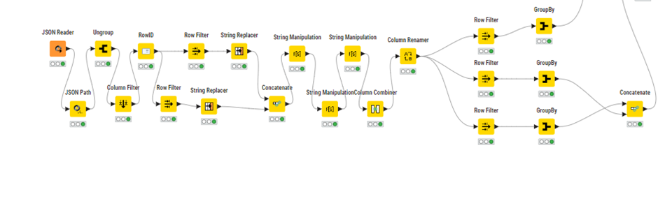

JSON Path, Ungroup, Column Filter noodit, käytetään Jsonin muuttamiseen Knime-taulukoksi. Joka näyttää seuraavalta:

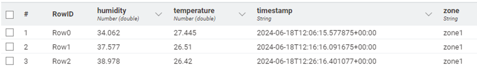

Rivi filtteri erittelee zonet, niin että zone1 (viherkatto) ja zonet 2 ja 3 (normaali katto) erotetaan eri taulukoiksi.  Merkkijono korvaajalla lisätään yksi sarake taulukkoon, joka kertoo onko katto viherkatto vai ei. 
String manipulation, Column combiner ja Column renamer -noodeilla parsetaan aikaleimasta päivämäärä ja tunti uudeksi “date” sarakkeeksi. 
Row filter -noodilla yhdistetään zone2 ja zone3 samaan taulukkoon keskenään, jotta voidaan lisätä sähköntuotto oikeisiin arvoihin. 
Group by -noodilla otetaan keskiarvot lämpötilasta ja kosteudesta joka tunnin välein. 

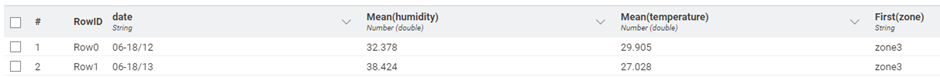

### Sähködata

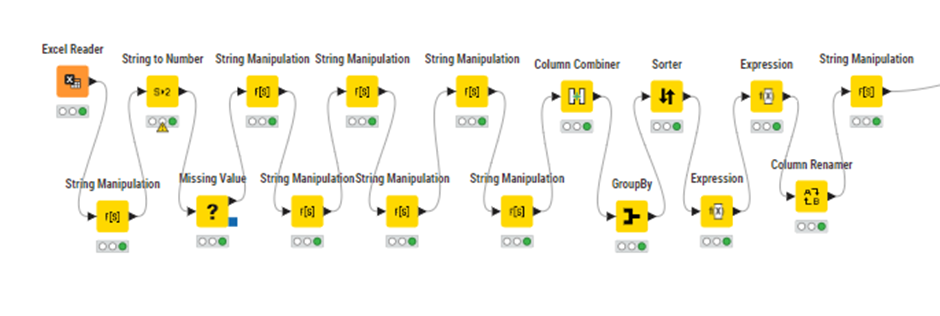

String manipulation -noodeilla parsetaan aikaleima erillisiksi sarakkeiksi: päivä, kuukausi, tunti. Missing Value -noodilla asetetaan puuttuvat arvot nolliksi. Column combiner -noodilla yhdistetään päivämäärä uudeksi sarakkeeksi, joka on samanlainen, kuin sama sarake anturidata taulukossa. Tätä päivämäärä saraketta käyttäen yhdistetään taulukot. 
Group by -noodilla otetaan keskiarvo sähköntuotosta tunnin välein, jotta se vastaa anturidatan aikaväliä. 
Expression -noodilla otetaan keskiarvo sähköpaneeleiden sähköntuotosta, koska ei ollut saatavilla vain yhden paneelin tuottoa. 

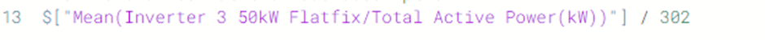

Joiner -noodilla yhdistetään sähködata anturidataan ja Concatenate -noodilla yhdistetään taulukot, jotka sisältävät viherkaton ja normaalin katon yhdeksi taulukoksi. Lopulta saadaan taulukko, joka näyttää seuraavalta: 
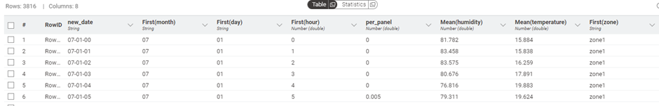

Taulukossa on sarakkeet:  rowID, päivämäärä, päivä, kuukausi, tunti, sähköntuotto(per paneeli), kosteus, lämpötila ja zone. 

Tarkastellaan sähköntuottoa: 

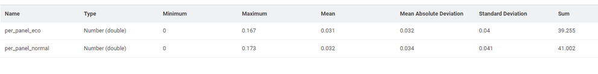

Kokonaistuotto (sum) koko ajalta on viherkatolla pienempi verrattuna normaaliin kattoon. 

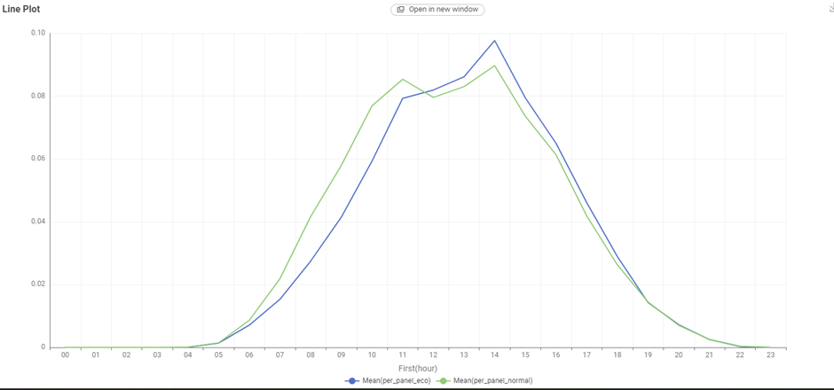

Tuntikohtaisesta kaaviosta havaitaan kuitenkin, että viherkatto tuottaa enemmän klo.12-18 välillä. Voidaan päätellä tästä, että viherkatolla saattaa olla päivällä optimaalisemmat olosuhteet sähköntuoton kannalta. 

## Statistical hypothesis testing/Linear Regression alanyysi

Nollahypoteesi: lämpötila ja kosteus ei vaikuta sähköntuottoon.
Tutkitaan vuorovaikutusta linear regression avulla

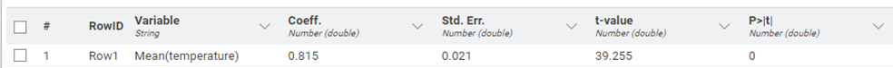
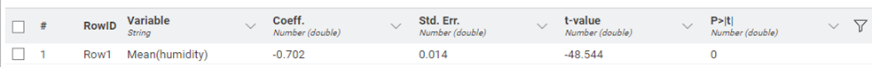
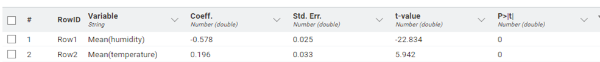

Ensimmäisessä kuvassa on käytetty parametreina pelkästään lämpötilaa, toisessa kosteutta ja viimeisessä molempia. T-arvosta nähdään, että kun lämpötila on korkeampi, myös sähköntuotto on korkeampaa, ja kun kosteus on matalampi, sähköntuotto on korkeampaa. P-arvo ollessa selkeästi alle 0,05 nollahypoteesi voidaan hylätä, ja todeta, että lämpötilan ja kosteuden vaikutus sähköntuottoon on tilastollisesti merkittävää.

Käytetään seuraavaksi KNIMEn Regression predictor -noodia ennustamaan sähköntuoton arvoja. 

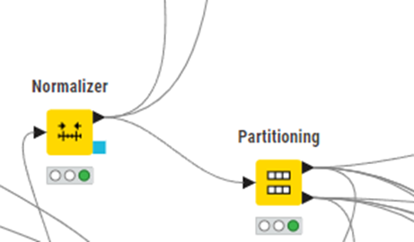
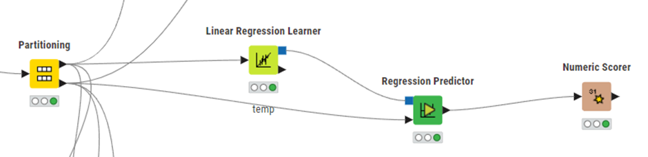

Normalisoidaan käytettävien parametrien arvot välille 0-100 ja käytetään Partitioning -noodia asetuksella 80-20 %, opettamaan Regression learner -algoritmia. Regression predictor -noodilla yritetään ennustaa sähköntuoton arvoja saadun algoritmin avulla. 
Käytetään Numeric Scorer -noodia arvioimaan, kuinka hyvä malli on ennustamaan arvoja. 

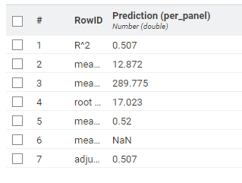

R^2 arvo kuvaa, kuinka hyvin lämpötila ja kosteus selittävät varianssia sähköntuotossa. Arvo on noin 0,5, joten voidaan todeta, että sähköntuottoon vaikuttaa myös muita muuttujia. Vaikka lämpötila ja kosteus selkeästi vaikuttavat sähköntuottoon, ne eivät yksin pysty selittämään sen vaihtelua. Jotta sähköntuottoa pystyttäisiin ennustamaan tarkasti tällä mallilla, tarvittaisiin lisää muuttujia, jotka vaikuttavat siihen.

Käytetään vielä lisäksi Linear correlation -noodia tulosten vahvistamiseksi.
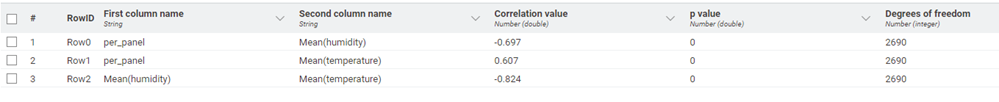
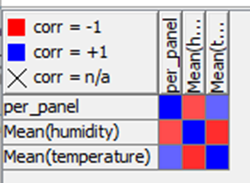

Linear correlation -noodin P-arvon alittaessa 0,05 todetaan, että lämpötilalla ja kosteudella on kohtalainen vaikutus sähköntuottoon. Tämä varmistaa jo Linear regression avulla saatuja tuloksia. Korrelaatiotaulukosta voidaan myös nähdä, että kosteus vaikuttaa hieman enemmän sähköntuottoon. Kosteuden korrelaatioarvo on negatiivinen, joten kosteuden laskiessa sähköntuotto yleisesti nousee. Lämpötila puolestaan vaikuttaa positiivisesti sähköntuottoon, eli lämpötilan noustessa sähköntuottokin nousee.

Linear regression -mallin tarkkuutta voidaan parantaa käyttämällä sähköntuoton parametrille sen luonnollista logaritmia ja käyttämällä Polynomial Regression Learneria havaitsemaan monimutkaisempia korrelaatioita datassa. 

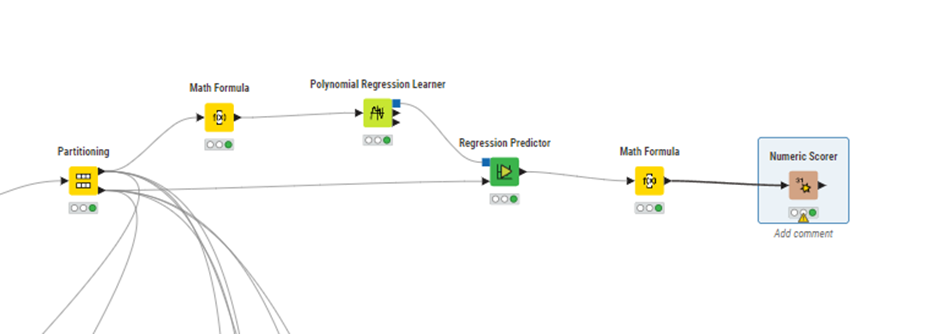

Käytetään Math formula -noodia muuttamaan sähköntuoton arvot niiden luonnoliseksi logaritmiksi. 

Käytetään samaan tyyliin Regression learner ja Prediction -noodeja. Lopuksi muutetaan ennustetut arvot “normaaleiksi” Math formula -noodin exponenttifunktion avulla.

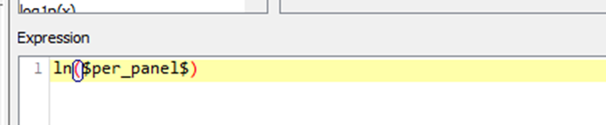
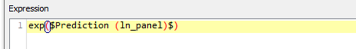

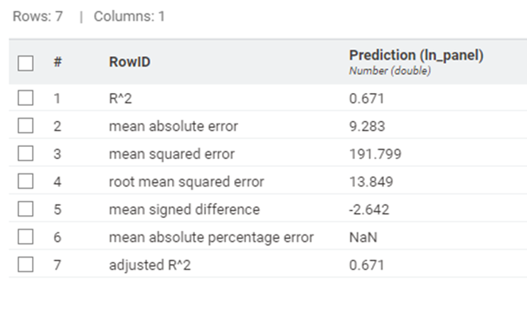

Kun verrataan saatuja tuloksia Linear regression -mallin tuloksiin, saadaan Polynomial regression -mallin avulla hieman parempia tuloksia. R^2 arvo on 0.67, joten malli selittää noin 67% sähköntuoton varianssista. Mean absolute error ja Mean squared error myös ovat pienempiä, joka viittaa parempaan tarkkuuteen. Kuitenkin tämäkin malli jättää vielä paljon selittämättä (KOMMENTTI: esim. mitä?)

## Clustering analyysi ja anomaly detection

Osiossa selvitetään, voidaanko datasta löytää selkeitä ryhmittymiä tai muusta datasta paljon poikkeavia tuloksia. 

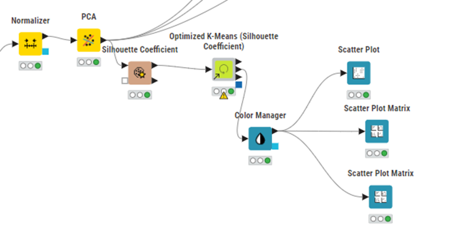

Käytetään klusterointiin optimized K-means -noodia, joka laskee parhaan klusterien määrän datan ja Silhouette Coefficientin avulla. Ennen klusterointia tehdään datalle Principal Component Analysis käyttäen PCA -noodia. Tämä vähentää datan dimensioita ja auttaa k-means -algoritmia saavuttamaan parempia tuloksia. PCA -noodiin otetaan parametreiksi lämpö, kosteus ja sähköntuotto. Sillä usein kaksi dimensiota riittää, otettiin yksi ylimääräinen varmuuden vuoksi, joten asetukseksi valittiin kolme dimensiota. Silhouette coefficient -noodiin otetaan parametreiksi mukaan lämpö, kosteus, sähkö, PCA -noodin antamat dimensiot ja zone, jotta mahdollisimman monet muuttujat saadaan huomioitua.

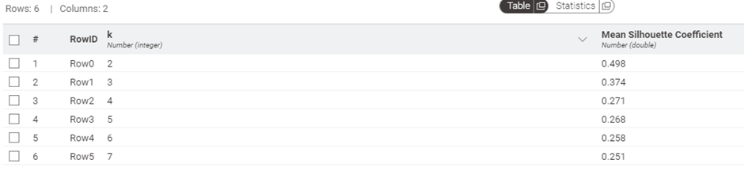

Optimized K-means antaa yllä olevan taulukon, joka osoittaa optimaalisen klusterien määrän datassa. Analyysin perusteella optimaalinen määrä klustereita on kaksi, sillä kahdella klusterilla on suurin Silhouette coefficient. Tämä viittaa siihen, ettei datassa synny selkeitä klustereita annetuilla parametreilla.

Tarkastellaan vielä visuaalisesti tuloksia:
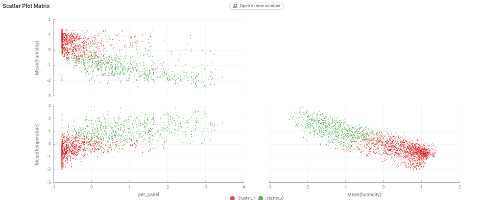

Kuvassa on kosteuden, lämpötilan ja sähköntuoton pistekaaviomatriisi, jossa väridimensioina ovat saadut klusterit. Kuvasta käy ilmi, että algoritmi jakaa datan keskeltä kahtia, mutta selkeitä klustereita ei synny.

Tarkastellaan vielä zonejen välisiä eroja:
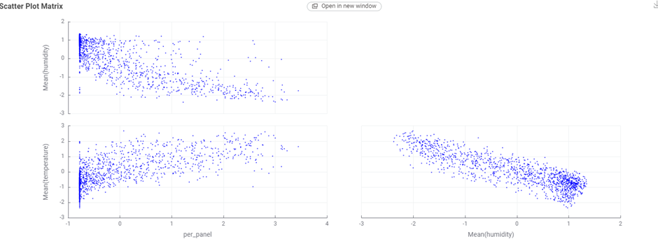
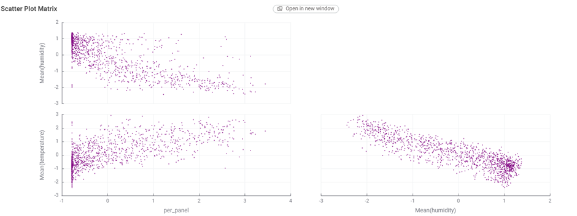
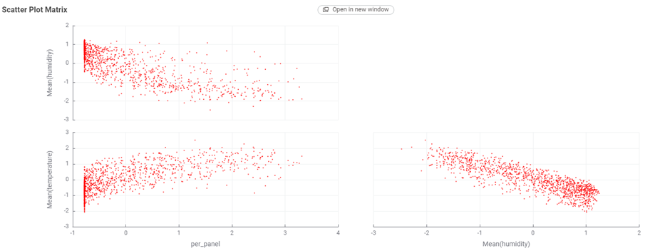

Kuvissa väridimensioksi on vaihdettu zonet 3, 2 ja 1 järjestyksessä. Kuten havaitaan, ei zonejen välillä ole merkittäviä eroja datapisteissä. Analyysin perusteella voidaan vahvistaa, ettei datasta löydy selkeitä klustereita tai keskittymiä, jotka voisivat selittää muuttujien varianssia.

Katsotaan seuraavaksi voidaanko löytää  datapisteitä, jotka eroavat muusta datasta merkittävästi klusteroinnin avulla.

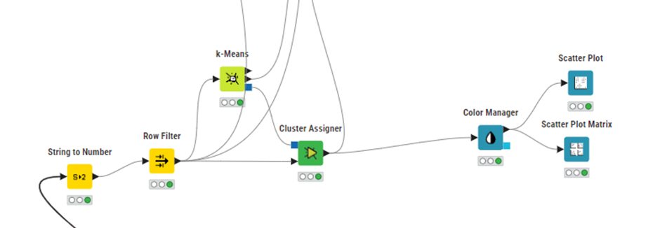

Käytetään String to number -noodia tekemään halutuista sarakkeista numeroita visualisoinnin helpottamiseksi. Käytetään normaalia K-means -noodia kolmella klusterilla ja Cluster assigner -noodilla asetetaan riveille saadut klusterit. 

Saadut klusterit näyttävät seuraavalta: 
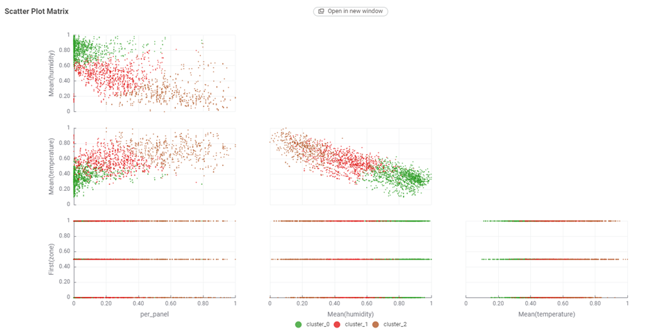

Kuten Optimized K-means -menetelmällä saadut klusterit, myös nämä näyttävät jakautuvan suurin piirtein kolmeen yhtä suureen osaan. Tarkastellaan seuraavaksi, löytyykö poikkeavuuksia.

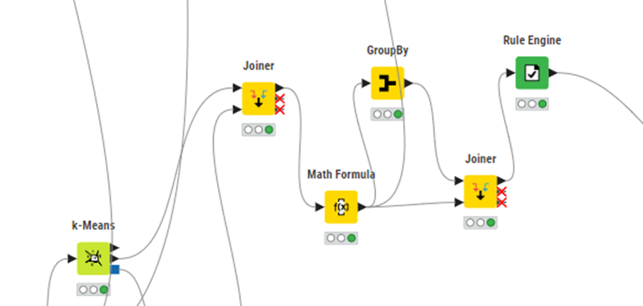

Yhdistetään K-means -noodin toisesta ulostulosta klustereiden keskuskohdat muuhun dataan. Math formula -noodilla lasketaan jokaisen rivin etäisyys klusterin keskuspisteestä kaavalla sqrt( (keskuspisteen x – rivin x)^2 + (keskuspisteen y – rivin y)^2 + (keskuspisteen z – rivin z)).  Group by -noodissa valitaan cluster-sarake ja Manual aggregation -välilehdeltä valitaan edellisessä Math formula -noodissa luotu etäisyys klusterin keskuksesta sarakkeiksi. 

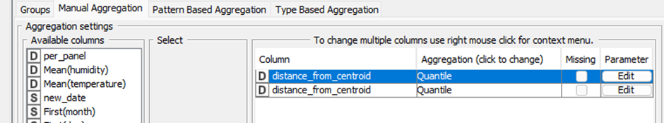

Valitaan asetuksista haluttu Quantile; tässä on käytetty 0.025 ja 0.975 eli arvot, jotka poikkeavat 5% kaikesta muusta datasta. 

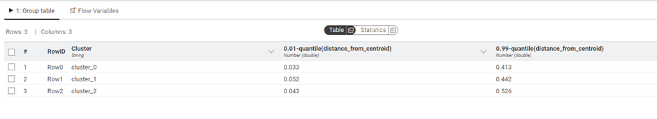

Saadaan taulukko, jossa on jokaisen klusterin arvot, jotka ovat pienimmät ja suurimmat 1 %. Joiner -noodilla yhdistetään nämä sarakkeet datataulukkoon. Rule engine -noodilla erotellaan rivit, joiden arvot ovat pienempiä kuin 0,025 tai suurempia kuin 0,975.

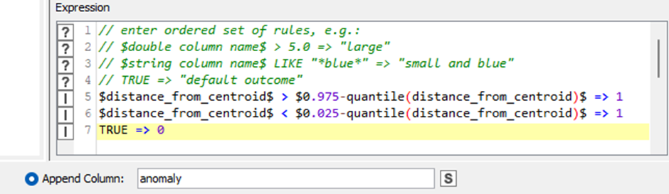

Lisätään uusi sarake, jossa arvo on 0 tai 1 sen mukaan, onko rivi poikkeava vai ei. Tämän jälkeen poikkeavat arvot pystytään visualisoida. Näillä parametreilla löydettiin 156 riviä, jotka täyttävät poikkeavuuden ehdot.

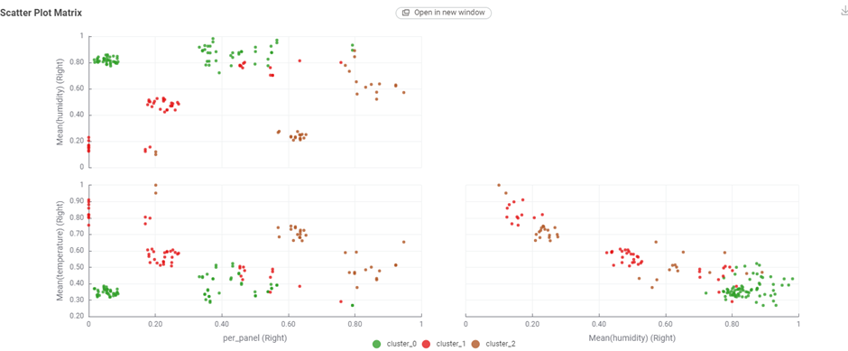

Edellisessä kuvaajassa on esitetty normaalista poikkeavat datapisteet.

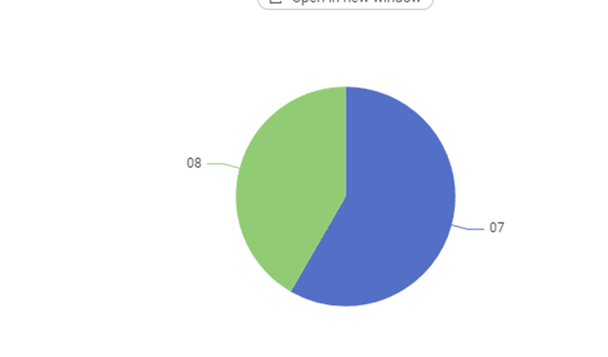

Toisesta kuvaajasta havaitaan, että poikkeavuuksia on hieman enemmän heinäkuussa. 

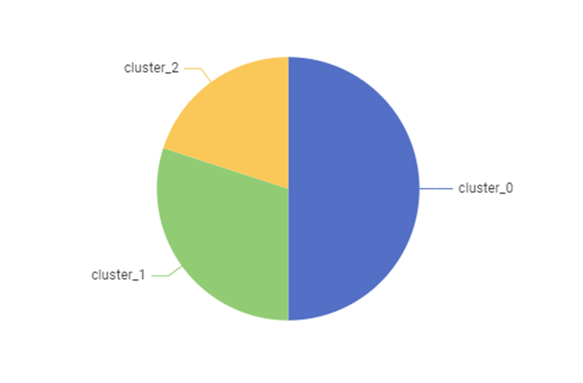

Kolmannen kuvaajan ensimmäisessä klusterissa on eniten poikkeavuuksia. Tämä voi johtua siitä, että data ei sovi hyvin klustereihin, kuten jo aiemmin dokumentaatiossa todettiin. 

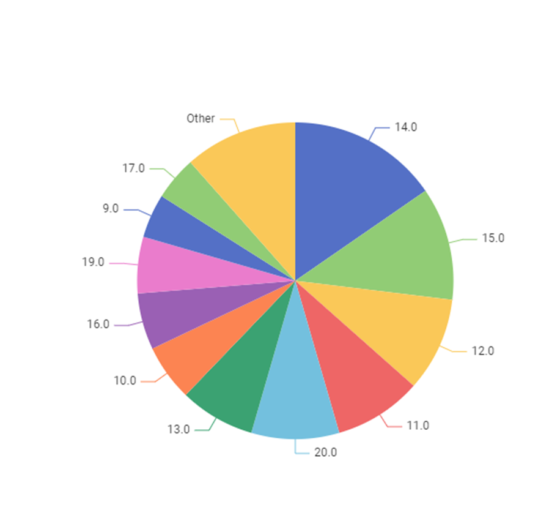

Neljännessä kuvaajassa poikkeamat on jaoteltu kellonajan mukaan. Poikkeamat jakautuvat kaikille kellonajoille, mutta kello 14-15 välillä niitä on selkeästi eniten.

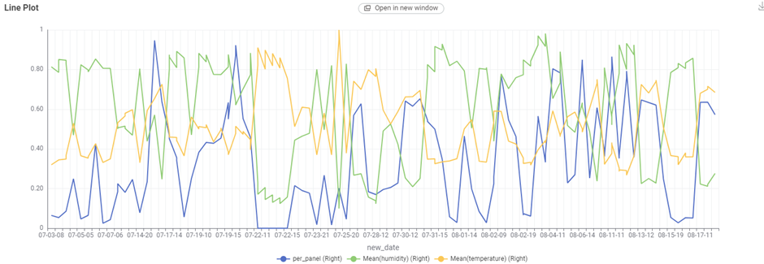

Viidennessä on esitetty sähköntuotto, kosteus ja lämpötila kaikilta poikkeusriveiltä. Poikkeustilanteissa sähköntuotto ja kosteus vaihtelevat enemmän kuin lämpötila.

Kuten kuvaajista ilmenee, poikkeustilanteet jakautuvat tasaisesti, painottuen kuitenkin kello 12-15 välille. Näihin aikoihin liittyy suuria kosteuden ja sähköntuoton vaihteluja. Kosteuden vaihteluiden tarkempaan selittämiseen tarvittaisiin tarkempaa tietoa sää- ja ympäristöolosuhteista.

## Koneoppimismallit

Osiossa selvitetään voidaanko dataan soveltaa KNIMEstä löytyvillä koneoppimismalleilla, kokeilemalla MLP ja Random forest -algoritmeja.

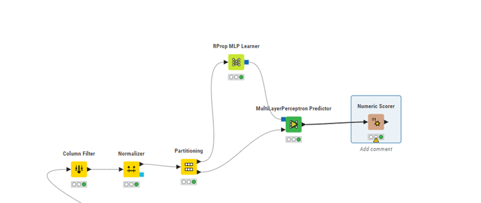

Valitaan Column Filter -noodilla datasta vain sähköntuotto, lämpötila ja kosteus, ja normalisoidaan data 0–1-väliin, jotta algoritmi toimii oikein. Erotaan testidata ja opetusdata toisistaan käyttämällä Partitioning -noodia. MLP Learner -noodissa asetetaan 500 iteraatiota, 10 hidden layeria ja 25 hidden neuronia per layer. Valitaan class-kolumniksi sähköntuotto. Predictor -noodilla ennustetaan sähköntuottoa saadun mallin avulla.

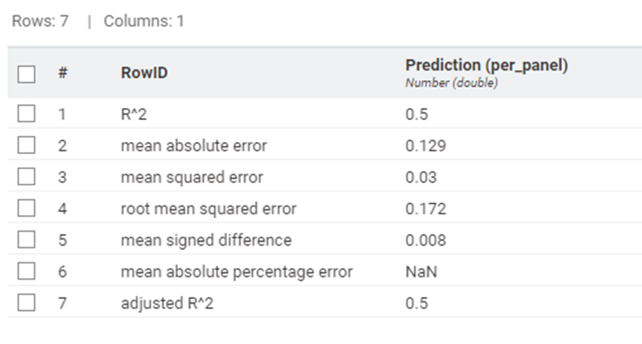

"Saadaan samankaltaisia tuloksia Linear Regression -malliin verrattuna: R² on 0,5 ja Mean Absolute Error noin 13 %. Voidaan todeta, että malli ei sovellu kovinkaan hyvin ennustamaan kyseistä dataa.

Kokeillaan seuraavaksi ennustaa zoneja Random Forest -algoritmin avulla. 

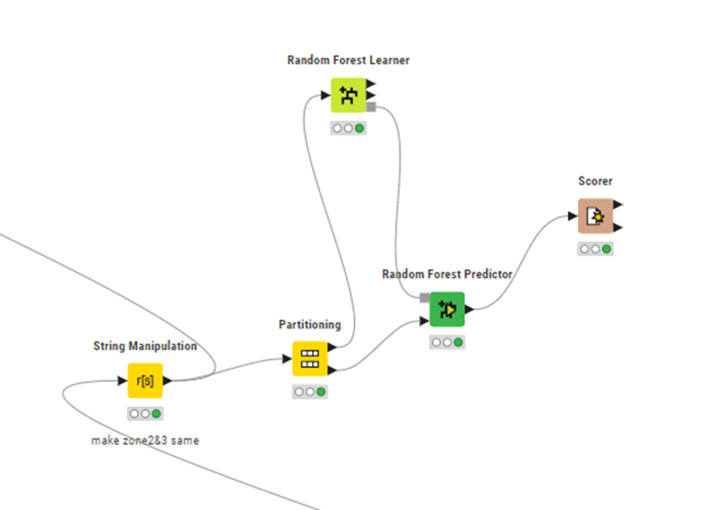

Random Forest -algoritmi ei vaadi normalisointia. Käytämme String Manipulation -noodia lisätäksemme sarakkeen, jossa yhdistetään zonet 2 ja 3 yhdeksi zoneksi, sillä ne ovat ominaisuuksiltaan identtisiä. Tavoitteena on selvittää, pystyykö algoritmi ennustamaan viherkattoa annetuista parametreistä. Käytämme jälleen Partitioning -noodia erottamaan testidatan ja opetusdatan. Random Forest Learner -noodissa otetaan parametreiksi kaikki mahdolliset muuttujat: kuukausi, päivä, tunti, lämpötila, kosteus ja sähköntuotto.

Tarkastellaan Scorer -noodilla tuloksia: 
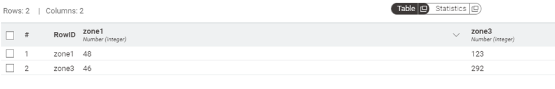
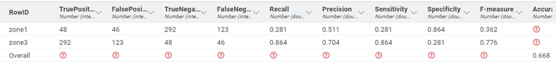

Ensimmäisessä kuvassa confusion -matriisi, josta nähdään ennustukset. Tilastoista ilmenee, että algoritmi ennustaa zone 3:ta noin 70 % tarkkuudella ja zone 1:stä noin 50 % tarkkuudella, saaden yhteensä noin 67 % tarkkuuden. Malli ei saavuta projektin tavoitteita, sillä halutaan viherkaton ennustuksen olevan tarkempi.

## Aikasarja-analyysi (Time-series)

Osiossa sovelletaan KNIMEn aikasarja-analyysi noodeja.
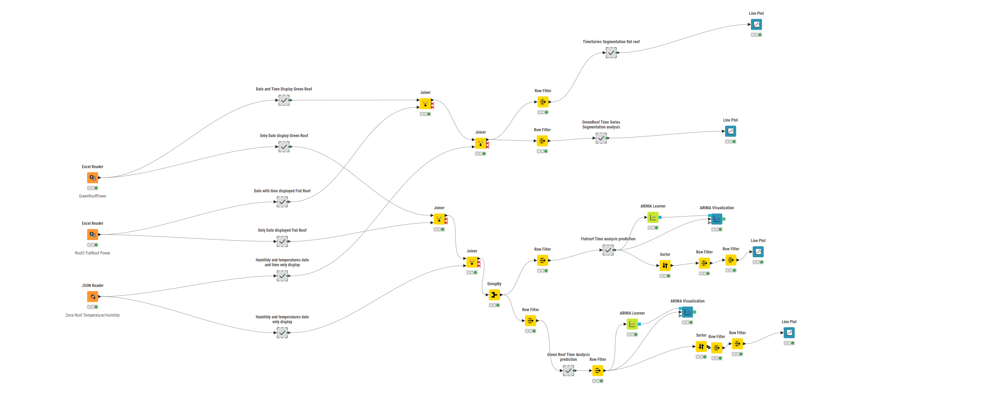

Analyysissä tarkistettiin Zone 1 ja Zone 3 ennusteita käyttämällä Multivariate Time-Series Forecasting -mallia ja Time-Series ARIMA -mallia.

### Multivariate Time-Series Forecasting tulos
Tuloksista käy ilmi, että kosteustasojen ja lämpötilojen vaikutus viherkatossa ei ole niin suurta kuin normaali katossa, jossa kosteus vaikuttaa sähköntuottoon päivittäin enemmän.
Korkeilla lämpötiloilla kosteus on alhaisempaa. Tämän analyysin perusteella viherkatto tuottaa parempia tuloksia sähköntuotossa, mutta tätä ei voida vielä varmistaa, sillä on olemassa monia muita tekijöitä, joita ei ole otettu tai joita ei ole voitu ottaa huomioon tässä analyysissä.
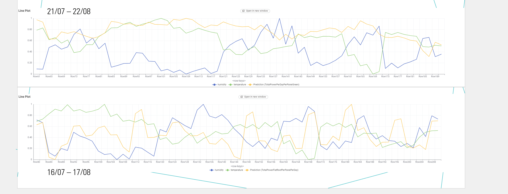

### Autoregressive Models (ARIMA) Time-series

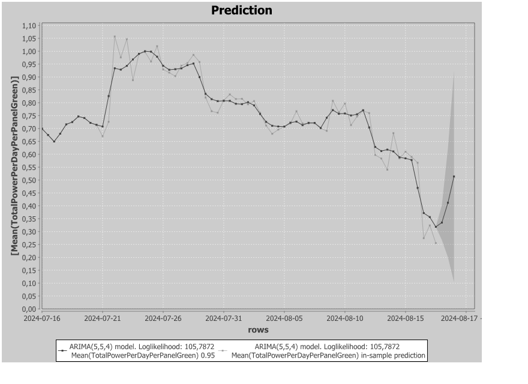
Viherkaton ennustus

Viherkaton ennustuksesta nähdään, että viherkaton datan 'log-likelihood' on korkea, mikä tarkoittaa, että data soveltuu hyvin ARIMA-analyysiin. Analyysistä havaitaan, että on melko suuri todennäköisyys sähköntuotannon nousulle seuraavina päivinä elokuussa.
Jos tarkastellaan tulevaisuutta ja olosuhteet heinä- ja elokuussa ovat lähes samat, sähkön tuotanto voi olla suurempaa kuin tänä vuonna.

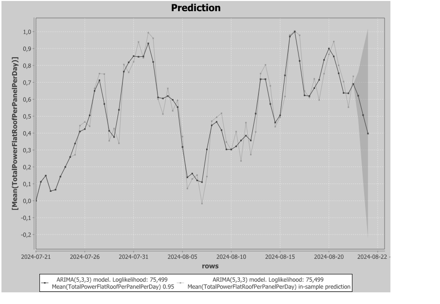
Normaalikaton ennustus

Normaalikaton ennustuksessa nähdään, että elokuussa tuotanto tulee olemaan suurempaa, mutta sitä seuraavat päivät tai kuukaudet todennäköisesti tuottavat vähemmän sähköä. Kuitenkin mahdollisuus tuottaa enemmän sähköä on edelleen hyvä. Datan 'log-likelihood' on alempi kuin viherkaton datassa; paras log-likelihood, joka voitiin saada analyysiin, on "75,499". Tämä tarkoittaa, että data sopii analyysiin, mutta se on huomattavasti vähemmän sopivaa kuin viherkaton data.

Molemmissa tuloksissa 95 %:n luottamusväli (confidence interval), joka tarkoittaa että analyysissä ollaan 95 % varmoja sähköntuoton laskusta. Ennusteen mukaan kuitenkin viherkatossa se nousee hyvin, kun taas normaalikatossa tuotanto todennäköisemmin laskee.

### Autoregressive Models (VAR) Time-series

ARIMA analyysin lisäksi sovellettiin VAR (Vector Autoregression) -mallia aikasarja-analyysiin. Validoinnin perusteella VAR-analyysi tuotti osittain tarkkoja tuloksia, mutta ero oikeiden sähkötuotantolukemien ja ennusteiden välillä oli merkittävä. Sähkötuotannon suuri ero elokuun ja syyskuun välillä (80 % pudotus) teki ennustuksesta haastavaa.

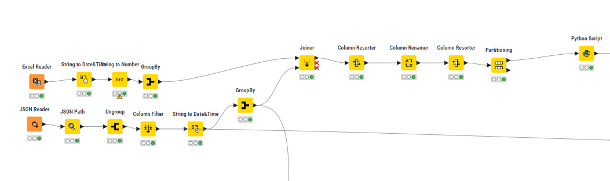

VAR-analyysiin käytetyt noodit KNIMEssä.

Aluksi lämpötila- ja kosteusarvot luettiin JSON-tiedostosta ja muutettiin taulukoksi Ungroup-noodeilla. Tämän jälkeen turhat sarakkeet suodatettiin pois Column Filter -noodilla, ja aika-arvot muutettiin oikeaan muotoon käyttäen String to Date&Time -noodia. Lopuksi datasta laskettiin päivittäinen keskiarvo Group By -noodilla.

Samat toimenpiteet tehtiin myös sähkötuotantodatalle. Aikasarake muutettiin oikeaan muotoon String to Date&Time -noodilla, ja sähkötuotannon arvot muunnettiin merkkijonoista luvuiksi String to Number -noodilla. Lopuksi sähködatasta laskettiin päivittäinen summa, ja datat yhdistettiin yhteen taulukkoon Joiner-noodilla.

Ennen itse analyysin tekemistä käytettiin Column Resorter ja Column Renamer -noodeja sarakkeiden nimeämiseen ja järjestämiseen. Ensimmäiset 80 % datasta valittiin VAR-analyysia varten, ja viimeiset 20 % jätettiin analyysin tarkistamiseksi.

Koska KNIME ei oletuksena sisällä noodia VAR-analyysille, käytettiin Python Script -noodille analyysin tekemiseen Pythonia ja Statsmodels -moduulia. Data otettiin KNIMEstä DataFrame -muodossa pandas-kirjaston avulla. Tämän jälkeen data analysoitiin ja palautettiin takaisin Python Script -noodin 'output_tables'-osioon.

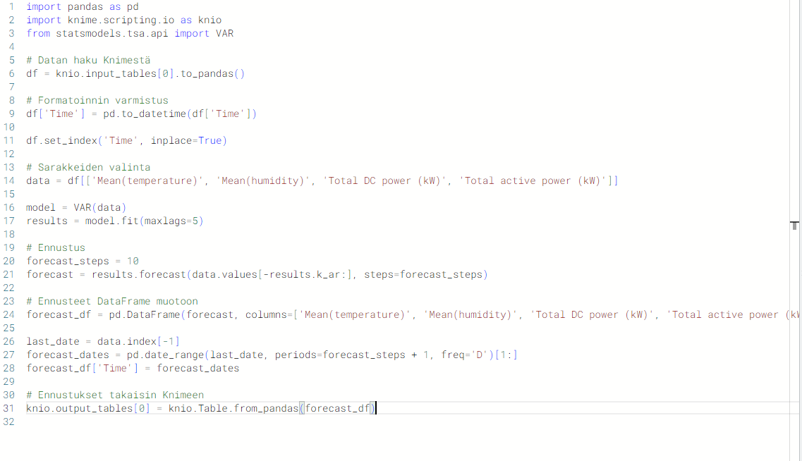
Python koodi VAR-analyysia varten.

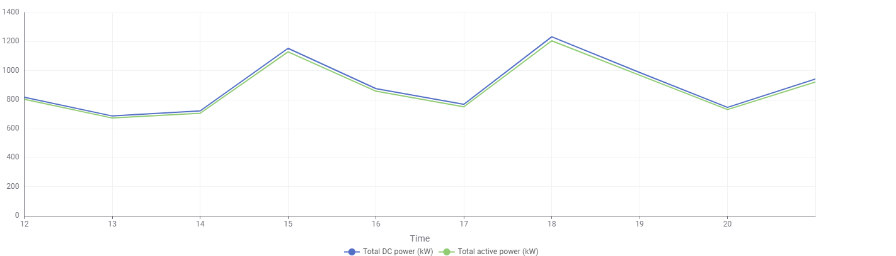
Sähkötuotannon ennustuksia normaalille katolle 12.8-21.8

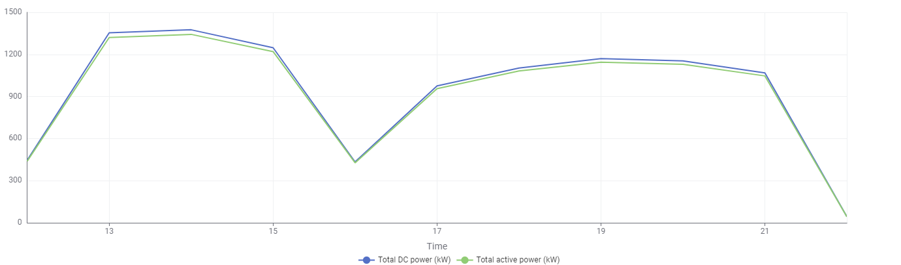
Oikeita sähkötuotannon oikeita arvoja normaalille katolle 12.8-21.8

## Yhteenveto

Tehtyjen tutkimusten perusteella havaittiin, että kosteus ja lämpötila vaikuttivat selkeästi sähköpaneelien sähköntuottoon. Lisäksi viherkaton ja normaalin katon välillä ei todettu merkittäviä eroja, joita oltaisiin voitu selittää pelkästään katon materiaalien eroilla. Parempien ennusteiden tekemiseksi tarvittaisiin enemmän tietoa olosuhteista, sekä pidemmän aikavälin dataa. Tutkimustulokset eivät olleet riittävän luotettavia kattojen olosuhteiden ollessa tarkastellulla aikavälillä liian erilaiset. Tietojen mukaan viherkattoa  kasteltiin epäsäännöllisesti, mikä teki kosteusarvoista ja muutoinkin viherkaton analyyseistä epätarkkoja.