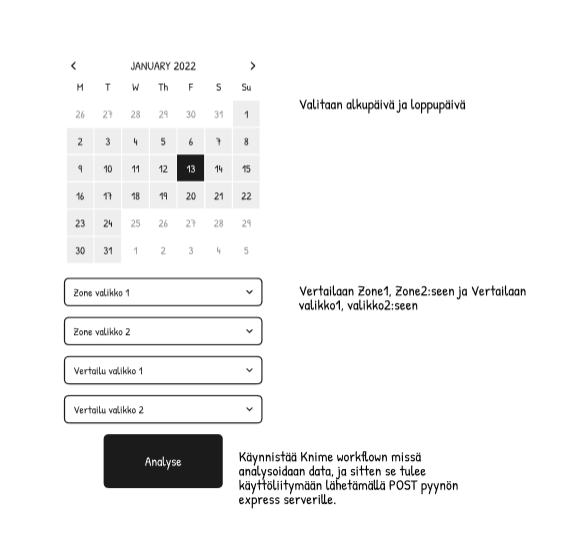
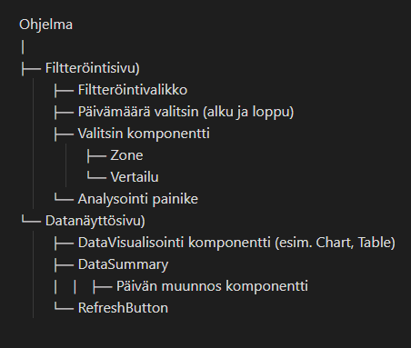
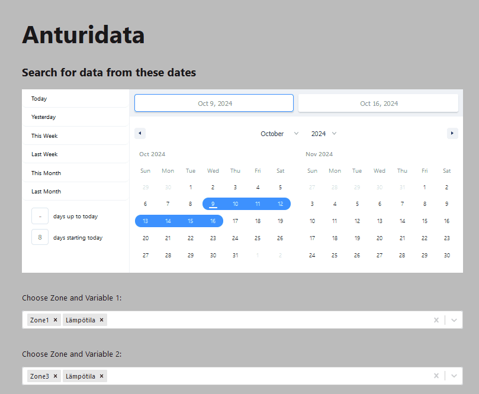

# Sovellusarkkitehtuuri ja käyttöliittymä

## Suunnittelu

[Toisessa sprintissä](../SprintReviews/SprintReview2.md) aloitettiin varsinainen käyttöliittymän suunnittelu luomalla prototyyppi Figmassa.


Kuvassa ensimmäinen näkymä. Prototyyppi helpotti hahmoittamaan, mistä kannattaa aloittaa käyttöliittymän suunnittelun suhteen.

Prototyypin myötä suunniteltiin, mitä toimintoja sovelluksessa pitäisi olla.


Kuvassa sekvenssikaavio. Alustavan sekvenssikaavion avulla hahmoitettiin, mitä käyttöliittymässä pitäisi pystyä tekemään. Kaavio ei ota huomioon sovelluksen oikeaa yhteyttä tietokantaan, sillä sitä ei oltu luontiaikana vielä tehty.



Kuvassa tekstinä hahmoteltu aluksi suunniteltua komponenttirakennetta.
Hahmotelma helpotti tietämään, mitä osia tarvitaan sivun toimintaan. Rakenne yksinkertaistui, kun selvisi, miten tietokantayhteys toimi ja mitkä toiminnot voidaan toteuttaa suoraan valmiilla React-kirjastoilla.

## Arkkitehtuuri


Kuvassa sovelluksen noudattama yksinkertainen käyttötapauskaavio.


Kuvassa arkkitehtuurin noudattama sekvenssikaavio. Kuvasta nähdään, miten käyttöliittymä yhdistyy tietokanta-aineistoon palvelimen ja Mongon avulla.


## Komponentit ja kehitys

Käyttöliittymän suunnittelu eteni toiminnallisuuksien toteutukseen, kuten datan valintaan, kuvaajan tyypin vaihtamiseen ja ajanjakson muokkaamiseen.

Reactilla ja TypeScriptillä luotiin käyttöliittymän ensimmäinen versio. Siihen sisältyi kalenterielementti `React-date-range`-kirjastolla, jolla käyttäjä voi valita ajanjakson datan hakemiseen, sekä monivalintalaatikot (React-select) zonejen ja muuttujien, kuten kosteuden ja lämpötilan, valitsemiseen. 



`React-date-range`-kirjastoa arvioitiin liian monimutkaiseksi, kalenterin viedessä oletuksena paljon tilaa näyttäessään kaksi kuukautta kerrallaan. Kirjastoksi vaihdettiin `React-multi-date-picker`, joka näyttää siistin valintakentän ja vain yhden kuukauden kerrallaan. 


### Menu.tsx

Komponentti hallitsee suurintaosaa näkyvistä elementeistä. Se olisi voitu myös jakaa useampaan osaan koodin luettavuuden parantamiseksi.
Menu.tsx yleistoiminta:
* Hallinnoi käyttäjän valintoja ja syötteitä: Alueet, muuttujat, analyysityypit ja päivämäärät.
* Lähettää tiedot backendille: Muodostaa POST-pyynnön, joka sisältää käyttäjän valinnat ja lähettää ne palvelimelle analysoitavaksi.
* Näyttää aikaisempia valintoja: Esittää käyttäjän aiemmin tallentamat tiedot ja mahdollistaa niiden tarkastelun.
*  Visualisoi dataa: Näyttää joko ARIMA- tai aikarivianalyysin graafisesti käyttäjän valintojen mukaisesti.

Komponentin keskeisiä ominaisuuksia:
* Päivämäärien valinta:
	* Käyttäjä voi valita aikavälin, jonka aikana analyysi suoritetaan.
	* Tarkistaa, että ensimmäinen päivämäärä on aikaisempi kuin toinen.
* Dynaamiset valintakentät:
    * Käyttäjä voi valita alueet ja muuttujat dynaamisesti, estäen esimerkiksi saman alueen valinnan kahdesti.
* Session hallinta:
    * Hakee käyttäjän session tunnisteen (sessionId) ja siihen liittyvät tallennetut tulokset backendilta.
* Datan lähetys:
    * Valmistelee datan POST-pyyntöä varten ja lähettää sen palvelimelle analysoitavaksi.


<details>
<summary><b>Klikkaa Menu.tsx koodi auki tästä</b></summary>

```typescript 
import React, {useState, useEffect} from "react";
import Select, {SingleValue} from "react-select";
import MultiDatePicker, {DateObject} from "react-multi-date-picker";
import "react-multi-date-picker/styles/colors/teal.css";
import axios from "axios";
import TimeSeriesChart from "./TimeSeriesChart.tsx";
import ArimaChart from "./ArimaChart.tsx";

/**
 * Menu-komponentti hallitsee käyttäjän valintoja, kuten alueita, muuttujia ja aikarajoja, ja
 * lähettää valitut tiedot backendille. Komponentti näyttää myös aiemmin valittuja data-pisteitä,
 * mahdollistaa tiedostojen lataamisen ja visualisoinnin joko ARIMA-mallilla tai aikarivillä.
 * 
 * Käyttää useState, useEffect ja axios-kirjastoa tietojen hakemiseen ja käsittelyyn.
 * - Haetaan ja tallennetaan sessionId sekä sessionin tulokset
 * - Hallitaan käyttäjän valintoja ja päivityksiä valintaobjekteille
 * - Suodatetaan valinnat dynaamisesti (esim. estetään sama alue valitsemasta kahdesti)
 * - Analysoidaan ja lähetetään valitut tiedot backendille POST-pyynnöllä
 * - Näytetään virheilmoituksia, kuten virheelliset päivämäärävalinnat
 * 
 * Komponentti renderöi:
 * - Valintapaneelin, jossa on alueiden, muuttujien ja analyysityyppien valinta
 * - Aikavälin valinta ja päivämäärien syöttö
 * - Datan valintapaneelin historiassa
 * - Analyysikaavio joko ARIMA-mallilla tai aikarivinä (TimeSeries)
 */

// Funktio hakee sessionId palvelimelta
const fetchSessionId = async () => {
    try {
        const response = await axios.get("http://localhost:3001/track-session", {
            withCredentials: true,
        });
        return (response.data as { sessionId: string }).sessionId; // Varmistetaan, että backend palauttaa sessionId
    } catch (error) {
        console.error("Error fetching session ID:", error);
        return null;
    }
};

// Funktio hakee sessionin tulokset sessionId:n perusteella
const fetchResultsBySession = async (sessionId: string) => {
    try {
        const response = await axios.get(`http://localhost:3001/results?sessionId=${sessionId}`, {
            withCredentials: true,
        });
        return response.data; // Palautetaan sessionille spesifit tulokset
    } catch (error) {
        console.error("Error fetching results:", error);
        return [];
    }
};

// Valintavaihtoehdot Select-komponentille
const options = [
    {value: "Zone1", label: "Zone1", type: "zone"},
    {value: "Zone2", label: "Zone2", type: "zone"},
    {value: "Zone3", label: "Zone3", type: "zone"},
    {value: "Kosteus", label: "Kosteus", type: "variable"},
    {value: "Lampotila", label: "Lämpötila", type: "variable"},
    {value: "ARIMA", label: "ARIMA", type: "analysis"},
    {value: "TimeSeries", label: "TimeSeries", type: "analysis"}
];

// Valittujen vaihtoehtojen tyypit
interface SelectedOptions {
    zoneOne: SingleValue<{ value: string; label: string; type: string }> | null;
    variableOne: SingleValue<{ value: string; label: string; type: string }> | null;
    zoneTwo: SingleValue<{ value: string; label: string; type: string }> | null;
    variableTwo: SingleValue<{ value: string; label: string; type: string }> | null;
    analysisType: SingleValue<{ value: string; label: string; type: string }> | null;
}

const Menu = () => {
    const [jsonData] = useState<any>(null);
    const [dates, setDates] = useState<DateObject[]>([]); // Päivämäärien tila
    const [selectedOptions, setSelectedOptions] = useState<SelectedOptions>({
        zoneOne: null,
        variableOne: null,
        zoneTwo: null,
        variableTwo: null,
        analysisType: null,
    });
    const [data, setData] = useState<any>(null);
    const [dateError, setDateError] = useState<string | null>(null); // Virheilmoitukset päivämääristä
    const [dataToSend, setDataToSend] = useState<any>(null); // Lähetettävä data
    const [isLoading, setIsLoading] = useState(false); // Lataustilan hallinta

    const [sessionId, setSessionId] = useState<string | null>(null); // SessionId:n tila
    const [sessionData, setSessionData] = useState<any[]>([]); // Sessionin datan tila
    const [selectedData, setSelectedData] = useState<any>(null); // Valittu data

    useEffect(() => {
        const initializeSession = async () => {
            const id = await fetchSessionId(); // Haetaan sessionId
            setSessionId(id);

            if (id) {
                const results = await fetchResultsBySession(id); // Haetaan sessionin tulokset
                setSessionData(results);
            }
        };

        initializeSession(); // Käynnistetään session alustus
    }, []);

    const handleDataSelection = (item: any) => {
        console.log("Selected Data:", item);
        setSelectedData(item); // Asetetaan valittu data
    };

    // Päivitetään dataToSend, kun riippuvuudet muuttuvat
    useEffect(() => {
        if (!dateError && dates.length >= 2 && selectedOptions.zoneOne && selectedOptions.variableOne && selectedOptions.analysisType) {
            setDataToSend({
                dates: dates.map((d) => d.format("YYYY-MM-DD")),
                zoneOne: selectedOptions.zoneOne?.value,
                zoneTwo: selectedOptions.zoneTwo?.value,
                variableOne: selectedOptions.variableOne?.value,
                variableTwo: selectedOptions.variableTwo?.value,
                analysisType: selectedOptions.analysisType?.value,
                jsonData: jsonData || [],
            });
        } else {
            setDataToSend(null); // Tyhjennetään data, jos syötteet ovat virheellisiä
        }
    }, [dates, selectedOptions, jsonData, dateError]);

    useEffect(() => {
        if (data) {
            setSelectedData(data);  // Asetetaan selectedData aina kun data muuttuu
        }
    }, [data]);

    // Lähetetään POST-pyyntö backendille
    const sendPostRequest = async () => {
        if (!dataToSend) return;
        setIsLoading(true); // Asetetaan lataustila päälle
        setData(null); // Tyhjennetään edelliset tiedot
        try {
            const response = await axios.post("http://localhost:3001/results", dataToSend, {
                withCredentials: true,
            });
            setData(response.data); // Asetetaan saatu data
            console.log("Fetched Data:", response.data);
        } catch (error) {
            console.error("Error sending POST request:", error);
        } finally {
            setIsLoading(false); // Poistetaan lataustila
        }
    };

    // Päivämäärän muutoksen käsittely
    const handleDateChange = (date: DateObject[]) => {
        setDates(date);

        if (date.length >= 2) {
            const firstDate = date[0].toDate(); // Muutetaan päivämäärä JavaScriptin Date-objektiksi
            const secondDate = date[1].toDate(); // Muutetaan toinen päivämäärä Date-objektiksi

            if (firstDate >= secondDate) {
                setDateError("Päivämäärä 1 tulee olla ennen Päivämäärää 2.");
            } else setDateError(null); // Tyhjennetään virhe, jos päivämäärät ovat oikein
        } else setDateError(null); // Tyhjennetään virhe, jos päivämäärävalinta ei ole täydellinen
    };

    // Valintojen muutoksen käsittely
    const handleSelectChange = (
        selected: SingleValue<{ value: string; label: string; type: string }> | null,
        name: keyof SelectedOptions
    ) => {
        setSelectedOptions((prev) => {
            const updated = {...prev, [name]: selected};

            // Estetään saman alueen valinta kahdesti
            if (name === "zoneTwo" && selected?.value === prev.zoneOne?.value) {
                return {...updated, zoneTwo: null};
            }
            return updated;
        });
    };

    // Suodatetaan Zone2 valinnat, jotta ei valita samaa aluetta kuin zoneOne
    const zoneTwoOptions = options.filter(
        (opt) => opt.type === "zone" && opt.value !== selectedOptions.zoneOne?.value
    );

    // Suodatetaan sessionData näyttämään vain nykyiselle sessionId:lle kuuluvat tiedot
    const filteredSessionData = sessionData.filter((item) => item.sessionId === sessionId);

    return (
        <div className="container">
            <div className="sidebar">
                <div className="headerpanel">
                    <h1>Anturidata</h1>
                </div>
                <br/>
                <br/>
                <h3>Hae dataa aikaväliltä:</h3>
                <MultiDatePicker value={dates} onChange={handleDateChange} range/>
                {dateError && <p className="error-message">{dateError}</p>}
                <br/>
                <br/>
                <h3>Valitse alueet ja muuttujat</h3>
                <div className="field">
                    <p>Ensimmäinen vertailtava alue:</p>
                    <Select
                        options={options.filter((opt) => opt.type === "zone")}
                        value={selectedOptions.zoneOne}
                        onChange={(selected) => handleSelectChange(selected, "zoneOne")}
                        placeholder="Valitse alue"
                    />
                </div>
                <div className="field">
                    <p>Toinen vertailtava alue:</p>
                    <Select
                        options={zoneTwoOptions}
                        value={selectedOptions.zoneTwo}
                        onChange={(selected) => handleSelectChange(selected, "zoneTwo")}
                        placeholder="Valitse alue"
                    />
                </div>
                <div className="field">
                    <p>Ensimmäinen vertailtava muuttuja:</p>
                    <Select
                        options={options.filter((opt) => opt.type === "variable")}
                        value={selectedOptions.variableOne}
                        onChange={(selected) => handleSelectChange(selected, "variableOne")}
                        placeholder="Valitse muuttuja"
                    />
                </div>
                <div className="field">
                    <p>Toinen vertailtava muuttuja:</p>
                    <Select
                        options={options.filter((opt) => opt.type === "variable")}
                        value={selectedOptions.variableTwo}
                        onChange={(selected) => handleSelectChange(selected, "variableTwo")}
                        placeholder="Valitse muuttuja"
                    />
                </div>
                <h3>Valitse Analyysin tyypi</h3>
                <div className="field">
                    <p>Tyypi:</p>
                    <Select
                        options={options.filter((opt) => opt.type === "analysis")}
                        value={selectedOptions.analysisType}
                        onChange={(selected) => handleSelectChange(selected, "analysisType")}
                        placeholder="Valitse alue"
                    />
                </div>
                <br/>
                <button className="submit-button" onClick={sendPostRequest} disabled={!dataToSend || isLoading}>
                    {isLoading ? "Lähetetään..." : "Lähetä valinnat"}
                </button>
            </div>
            <div className="content">
                <h3>   </h3>
                {/* Rullattava säiliö nappuloille */}
                <div className="historyData" style={{maxHeight: "300px", overflowY: "scroll"}}>
                    {filteredSessionData.map((item, index) => (
                        <button
                            key={index}
                            className="historyDataButton"
                            onClick={() => handleDataSelection(item)}
                        >
                            Data {index + 1} {/* Käytä itemin tietoja jos saatavilla */}
                        </button>
                    ))}
                </div>
                <div className="chart-container">
                    {(selectedData || data) ? (
                        ((selectedData?.data?.[0]?.analysisType?.[0] || data?.data?.[0]?.analysisType?.[0]) === "arima") ? (
                            <ArimaChart
                                jsonData={{
                                    data: {
                                        jsonData: selectedData ? [selectedData] : [data], // Käytetään selectedData jos saatavilla; varmuudeksi data
                                    },
                                }}
                            />
                        ) : (
                            <TimeSeriesChart
                                jsonData={{
                                    data: {
                                        jsonData: selectedData ? [selectedData] : [data], // Sama logiikka täällä
                                    },
                                }}
                            />
                        )
                    ) : (
                        <div>Ei dataa saatavilla</div>
                    )}
                </div>
            </div>
        </div>
    );
};
export default Menu;
```
</details>

## Tyylittely

Käyttöliittymään on tehty hienovaraisen minimalistista tyylittelyä ja responsiivisuutta CSS koodilla.

Tyyli keskittyy responsiivisuuteen ja visuaaliseen ilmeeseen. Suuremmilla näytöillä käytetään flexbox-asettelua, mutta pienemmillä näytöillä elementit asetetaan pystysuuntaan ja ulkoasu pienenee, jotta se mahtuu pienemmille ruuduille. Värit, fontit ja varjot on valittu luettavuuden ja visuaalisen miellyttävyyden parantamiseksi. Lisäksi vuorovaikutteiset elementit, kuten painikkeet, saavat hover-efektejä.

<details>
<summary><b>Klikkaa CSS koodi auki tästä</b></summary>

```css
   :root {
	font-family: Inter, system-ui, Avenir, Helvetica, Arial, sans-serif, "Exo";
	line-height: 1.5;
	font-weight: 400;
	color-scheme: light;
	color: #2a2a2a;
	background-color: #bbbbbb;
	font-synthesis: none;
	text-rendering: optimizeLegibility;
	-webkit-font-smoothing: antialiased;
	-moz-osx-font-smoothing: grayscale;
}

*, *::before, *::after {
	box-sizing: border-box;
}

body {
	margin: 0;
	min-width: 100vh;
	min-height: 100vh;
	display: display-box;
}

.container {
	display: flex;
	height: 100vh;
	width: 100%;
	flex-direction: row;
}

.sidebar {
	width: 350px;
	padding: 16px;
	background-color: #f5f5f5;
	border-right: 1px solid #ddd;
	overflow-y: auto;
	box-shadow: 4px 0 10px rgba(0, 0, 0, 0.2);
	transition: width 0.3s ease;
}

.headerpanel {
	background-color: #777d8f;
	padding: 8px;
	margin: 0;
	border-radius: 0;
	color: white;
	width: calc(100% + 32px);
	margin-left: -16px;
	box-sizing: border-box;
	text-align: center;
}

.sidebar h1 {
	font-size: 2em;
	margin: 20px 0;
	letter-spacing: 2px;
	text-transform: uppercase;
	font-weight: bold;
}

.sidebar h3 {
	font-size: 1.1em;
	margin-top: 10px;
	color: #474747;
}

.field {
	padding-bottom: 12px;
	border-bottom: 1px solid rgba(0, 0, 0, 0.1);
}

.sidebar p {
	color: #2a2a2a;
}

input[type="file"] {
	margin-top: 0;
	width: 100%;
}

button {
	border-radius: 5px;
	border: none;
	padding: 10px;
	background-color: #5394be;
	color: white;
	cursor: pointer;
	transition: background-color 0.3s;
	margin-right: 10px;
	font-size: 1em;
}

button:hover {
	background-color: #5ea9db;
}

button:disabled {
	background-color: #ccc;
	cursor: not-allowed;
}

.content {
	width: 60vw;
	flex: 1;
	background-color: #c6cbd8;
	display: flex;
	flex-direction: column;
	align-items: center;
	justify-content: center;
}

.chart-container {
  width: 100%;
  height: 100%;
  max-width: 1200px;
	min-width: 350px;
  align-items: flex-start;
  justify-content: flex-start;
}

.content h2 {
	font-size: 1.4em;
	text-align: center;
}

.read-the-docs {
	color: #888;
	text-align: center;
}

.logo {
	height: 5em;
	padding: 1em;
	will-change: filter;
	transition: filter 300ms;
}
.logo:hover {
	filter: drop-shadow(0 0 1.5em #646cffaa);
}

@media (prefers-reduced-motion: no-preference) {
	a:nth-of-type(2) .logo {
		animation: logo-spin infinite 20s linear;
	}
}

/* Responsive styles */
@media (max-width: 768px) {
	.container {
		flex-direction: column;
	}
	.sidebar {
		width: 100%;
		border-right: none;
		border-bottom: 1px solid #ddd;
		padding: 10px;
	}
	.headerpanel {
		width: 100%;
		margin-left: 0;
	}
	.content {
		padding: 10px;
		align-items: stretch;
	}
	.sidebar h1 {
		font-size: 1.8em;
		letter-spacing: 1px;
	}
}

@media (max-width: 480px) {
	.sidebar {
		padding: 8px;
	}
	.headerpanel {
		padding: 6px;
	}
	.sidebar h1 {
		font-size: 1.5em;
	}
	button {
		padding: 8px;
		font-size: 0.9em;
		margin-right: 5px;
	}
	.content h2 {
		font-size: 1.2em;
	}
}

.json-upload, .json-label, .error-message {
	margin: 8px 0;
}

.submit-button {
	margin-top: 10px;
	padding: 10px;
	color: white;
	border: none;
	border-radius: 5px;
	cursor: pointer;
	transition: background-color 0.3s;
}

.submit-button:disabled {
	background-color: #ccc;
	cursor: not-allowed;
}
```
</details>

### Kuvaajien tyylit ja tekstit

Kuvaajien tekstien upotusta ja tyylittelyä testattiin vastaavalla koodilla ennen toimivan tietokantayhteyden toteutumista.
<details>
<summary><b>Klikkaa ChartComponent.tsx koodi auki tästä</b></summary>

```typescript
import React from "react";
import CanvasJSReact from "@canvasjs/react-charts";

const { CanvasJSChart } = CanvasJSReact;

interface ChartProps {
	dataPoints: { label: string; y: number }[];
}
const Chart: React.FC<ChartProps> = ({ dataPoints }) => {
	const options = {
		animationEnabled: true,
		theme: "light2",
		title: {
			text: "Kuvaajan nimi",
			fontColor: "#2C3E50",
			fontSize: 24,
			fontWeight: "bold",
		},
		axisX: {
			title: "Aikaväli",
			titleFontSize: 18,
			titleFontWeight: "bold",
			labelFontColor: "#34495E",
			labelFontSize: 14,
		},
		axisY: {
			title: "Laskettu arvo",
			titleFontSize: 18,
			titleFontWeight: "bold",
			labelFontColor: "#34495E",
			labelFontSize: 14,
			includeZero: false,
		},
		data: [
			{
				type: "line",
				toolTipContent: "<b>{label}</b>: {y}",
				dataPoints: dataPoints,
				lineColor: "#3498DB",
				markerColor: "#E74C3C",
				markerSize: 8,
			},
		],
	};

	return (
		<div>
			<h2 style={{ color: "#2C3E50", textAlign: "center" }}>Interaktiivinen Kuvaaja</h2>
			<CanvasJSChart options={options} />
		</div>
	);
};
export default Chart;
```
</details>

Tältä osin tyylittely jäi vajaaksi, sillä rakenteen jakautuessa uusiin luokkiin `ArimaChart.tsx` ja `TimeSeriesChart.tsx`, näitä muutoksia ei ehditty sijoittaa uusiin luokkiin. Jatkokehitys ehdotuksista löytyy maininta [Jatkokehitys](../README.md#jatko) osiosta. Kuvaajien akseleiden nimikentät olisi hyvä tehdä dynaamisiksi.

## Backend yhteys

Käyttöliittymässä toteutettiin POST- ja GET-pyyntöjä, joilla tuloksia siirretään Express-palvelimen kautta. Tiedot tallentuvat tietokantaan tulevia hakuja varten. Voit lukea asiasta tarkemmin: [Käyttöliittymä KNIMEllä](KäyttöliittymäKNIME.md)

Käyttäjän valitsemat parametrit lähetetään käyttöliittymästä POST-pyynnöllä Pythonille, joka suoritti analyysit ja palautti tulokset käyttöliittymään. Tulokset tallennetaan tietokantaan, josta niitä voitiin hakea GET-pyynnöillä. SessionID-järjestelmä varmistaa analyysien yksityisyyden ja käyttäjäkohtaisen saatavuuden.

## Backend Komponentit

### App.ts
App.ts sisältää backend applikaation

Express routeria käytetään pyyntöjen käsittelyyn.
tällä hetkellä seuraavat routet on käytettävissä. 
Router.ts: 
```typescript
const fileRouter = Router()
fileRouter.get('/', getResults)
fileRouter.get('/results', getResults)
fileRouter.get('/track-session', trackSession)
fileRouter.post('/track-session', trackSession)
fileRouter.post('/results', postResults)
fileRouter.post("/test", postTest)
```

Cors:ia käytetään antamaan käyttöoikeus vain tietyille domaineille. 

Luodaan sessio ja samalla coocie, jonka avulla voidaan asettaa tallennetuille datoille sessionId parametri
```typescript
app.use(session({
    secret: process.env.SESSION_SECRET, // using env file secret
    resave: false,
    saveUninitialized: true,
    httpOnly: true,
    store: MongoStore.create({
        mongoUrl: process.env.MONGO_DB_URI, // using env file secret
        collectionName: 'sessions',
        ttl: 3600000 // 1 hour session duration
    }),
    cookie: {
        maxAge: 3600 * 24 * 365 * 10 * 1000, // 10 years in milliseconds
        httpOnly: true,
        secure: process.env.NODE_ENV === 'production'
    }
}));
```

Luodaan mongodB yhteys connectDB metodilla: 
```typescript
//establish mongodb connection
export default async function connectDB(uri = process.env.MONGO_DB_URI as string) {
    mongoose.connect(uri = process.env.MONGO_DB_URI as string).then(()=>{
        console.log("Connected to database");
    }).catch((error)=>{
        console.log("Connection failed", error);
    });
}
```
Kuunnellaan porttia 3001

### mongodB schemat

ResultDataSchema käytetään muuttujien ja datan kuvaamiseen

```typescript
const resultDataSchema = new Schema({
    //dates to analyse
    dates: {
        type: [String],
    },
    //zones to analyse
    zones: {
        type: [String],
    },
    //variables such as temperature or humidity
    variables: {
        type: [String]
    },
    //data gotten from the analysis
    jsonData:{
        type: [Object]
    }
})
```

Postdata nimellä oleva DataSchema käytetään datan tallentamiseksi
```typescript
const DataSchema = new Schema({
    //name
    name: {
        type: String,
        required: true,
        default: "results"
    },
    //sessionId for the user
    sessionId: {
        type: String,
        required: true,
    },
    //timestamp
    createdAt: {
        type: Date,
        required: true,
        default: Date.now()
    },
    //data as resultData object
    data: {
        type: [resultData.schema],
        required: true
    },
    //graphtype to use for this data (set at frontend)
    graphType: {
        type: String,
    }
    
})
```
data on muotoa resultData ja graphtype saadaan frontendistä


### Controller.ts
Controller.ts työ on hoitaa express.js kutsuja ja tallentaa tulevaa dataa tietokantaan.

Tämän koodin idea on tallentaa Google Cloud Platformin API:n käyttöoikeudet ympäristömuuttujaan, jotta Python-skriptit voivat käyttää niitä.

```typescript
process.env.GOOGLE_APPLICATION_CREDENTIALS = resolve(__dirname, '../util/pythonScripts/anturiPy/prj-mtp-jaak-leht-ufl-a50dabd764ca.json');
```
Python-skriptit on "analyysi" koodeja, jotka suorittavat analyysit ja tulostavat Node.js:ään JSONin tulos datasta.
Koodi miten python-skriptissä käytetään ympäristömuuttujaa:
````python
import os
import sys

service_account_key_path = os.getenv('GOOGLE_APPLICATION_CREDENTIALS')
````
#### getResults - metodi
Tämä metodi hakee tietokannasta kaikki tulokset ja palauttaa ne JSON-muodossa express serverille "/results" endpointille.
```typescript
const getResults = async (req, res) => {
    try {
        const data = await PostData.find({}) // Haetaan kaikki tulokset tietokannasta
        return(res.json(data)) // Palautetaan tulokset JSON-muodossa
    } catch (error) {
        console.error("Failed to fetch results:", error); // Virheilmoitus, jos tulosten haku epäonnistuu
        return res.status(500).json({message: 'Error fetching data', error}); // Palautetaan status 500 ja virheilmoitus
    }

}
```
#### postTest - metodi
Tämä metodi on testi metodi, joka tallentaa tietokantaan testi dataa ja sen avulla varmistetaan, että JSON menee oikeassa muodossa tietokantaan.

````typescript
const postTest = async (req, res) => {
    const new_data = new PostData ({
        name: "moi",
        sessionId: "sfsfsdf",
        data: new resultData ({
            dates: "x-y",
            zones: ["x","t"],
            variables: ["d", "c"],
            jsonData: {
                moi: "moi",
                test: "testt"
            }
        })

    })

    try{
        const result = new_data.save()  // Tallennetaan data tietokantaan
        return res.status(200).send(result) // Palautetaan status 200 ja tallennettu data

    }catch (error){
        return res.status(500).send(error) // Palautetaan status 500 ja virheilmoitus
    }


}
````
#### trackSession - metodi
Tällä metodilla tarkisteetaan käyttäjän sessionID. Käyttäjille luodaan sessionID erillisellä metodilla, joka asettaa käyttäjälle sessionID:n evästeeseen.

trackSession:
````typescript
const trackSession = async (req, res) => {
    const sessionId = req.sessionID;
    const sessionData = req.session;

    console.log(`Client's session ID: ${sessionId}`);
    console.log(`Client's session data:`, sessionData);

    return res.send({ message: 'Session tracked', sessionId });
}
````
App.ts, siellä asetetaan sessionID evästeeseen:
````typescript
app.use(session({
    secret: process.env.SESSION_SECRET, // using env file secret
    resave: false,
    saveUninitialized: true,
    httpOnly: true,
    store: MongoStore.create({
        mongoUrl: process.env.MONGO_DB_URI, // using env file secret
        collectionName: 'sessions',
        ttl: 3600000 // 1 hour session duration
    }),
    cookie: {
        maxAge: 3600 * 24 * 365 * 10 * 1000, // 10 years in milliseconds
        httpOnly: true,
        secure: process.env.NODE_ENV === 'production'
    }
}));
````
#### postResults - metodi
Tämä metodi tallentaa käyttäjän valitsemat parametrit tietokantaan ja lähettää ne Python-skriptille analysoitavaksi.
````typescript
const postResults = async (req, res) => {
    const {  dates, zoneOne, zoneTwo, variableOne, variableTwo, analysisType, jsonData } = req.body;

    console.log(`Received data for id: ${dates}, ${zoneOne}, ${zoneTwo}, ${variableOne}, ${variableTwo}, ${jsonData}, ${analysisType}`);

    try {
        if (analysisType === 'ARIMA') {
            // Execute Python script to get results
            const result = await executePython(resolve(__dirname, '../util/pythonScripts/anturiPy/analyysiNodejs.py'), [dates, zoneOne, zoneTwo, variableOne, variableTwo, analysisType, jsonData])
            const postData = new PostData({
                sessionId: req.sessionID,
                data: result
            });

            // Save the new data to MongoDB
            const savedData = await postData.save();

            // Send the new data back to the client
            return res.status(201).json({message: 'Data saved', data: savedData.data});
        }
        if (analysisType === 'TimeSeries') {
            // Execute Python script to get results
            const result = await executePython(resolve(__dirname, '../util/pythonScripts/anturiPy/analyysiTimeSeries.py'), [dates, zoneOne, zoneTwo, variableOne, variableTwo, analysisType, jsonData])
            const postData = new PostData({
                sessionId: req.sessionID,
                data: result
            });
            // Save the new data to MongoDB
            const savedData = await postData.save();

            // Send the new data back to the client
            return res.status(201).json({message: 'Data saved', data: savedData.data});
        }
    } catch (error) {
        console.error(error);
        return res.status(500).json({ message: 'Error saving data' });
    }
}
````
Parametrit menee Python-skriptille "executePython" metodin kautta:
````typescript
const {  dates, zoneOne, zoneTwo, variableOne, variableTwo, analysisType, jsonData } = req.body; // Haetaan parametrit request bodysta

const result = await executePython(resolve(__dirname, '../util/pythonScripts/anturiPy/analyysiNodejs.py'), [dates, zoneOne, zoneTwo, variableOne, variableTwo, analysisType, jsonData])
````
parametrit lähetetään pythoniin tässä kohdassa:
[dates, zoneOne, zoneTwo, variableOne, variableTwo, analysisType, jsonData]

Pythonissa voi hakea parametrit seuraavasti:
````python
args = [arg.lower() for arg in sys.argv]

# Read inputs
dates = args[1]  # Date range as string, e.g., 2023-01-01,2023-12-31
zoneOne = args[2]  # Zone identifier, e.g., 'zone2'
zoneTwo = args[3]  # Zone identifier, e.g., 'zone3'
variableOne = args[4]  # Variable, e.g., 'humidity'
variableTwo = args[5]  # Variable, e.g., 'temperature'
analysisType = args[6]
jsonData = args[7]  # Optional input JSON data (if required)
````
## analyysiTimeseries.py
Tämä Python-skripti suorittaa aikasarja-analyysin käyttäjän valitsemilla parametreilla ja palauttaa tulokset JSON-muodossa.

Tärkeintä muistaa kaikissa analyysi python-skripteissä on, että päivämäärät muutetaan datetime-objekteiksi, jotta niitä voidaan käsitellä oikein.

Se onnistuu seuraavasti python-skriptissä:
````python
# Process dates string to separate start and end dates
start_date_str, end_date_str = dates.split(",")  # Split at the comma
start_date_str = start_date_str.strip()  # Remove any extra spaces
end_date_str = end_date_str.strip()  # Remove any extra spaces

# Convert the string dates into datetime objects
start_date = pd.to_datetime(start_date_str)
end_date = pd.to_datetime(end_date_str)

# Ensure that start_date and end_date are timezone-aware (UTC)
start_date = start_date.replace(tzinfo=pytz.UTC)
end_date = end_date.replace(tzinfo=pytz.UTC)

# Filter the data to only include rows within the date range
df = df[(df['timestamp'] >= start_date) & (df['timestamp'] <= end_date)]
````
seuraavaksi suoritetaan aikasarja-analyysi:
````python
# Filter for specific zones
if zoneOne in zones and zoneTwo in zones:
    df = df[df['zone'].isin([zoneOne, zoneTwo])]

# Ensure the data is properly indexed and has a frequency
df.set_index('timestamp', inplace=True)

# Handle duplicates: Aggregating by taking the mean for each timestamp
df = df.groupby([df.index, 'zone']).agg({
    'id': 'first',  # Use the first ID for each group
    'humidity': 'mean',  # Average the humidity for duplicates
    'temperature': 'mean'  # Average the temperature for duplicates
}).reset_index()

# Pivot to have separate columns for each zone's data
df_pivoted = df.pivot(index='timestamp', columns='zone', values=['humidity', 'temperature'])

# Generate plot data for selected zones
def generate_plot_data(df_pivoted, zoneOne, zoneTwo):
    plot_data = []
    for zone in [zoneOne, zoneTwo]:
        if zone in zones:
            zone_data = {
                'zone': zone,
                'humidity': df_pivoted['humidity'][zone].dropna().tolist(),
                'temperature': df_pivoted['temperature'][zone].dropna().tolist(),
                'timestamps': df_pivoted['humidity'][zone].dropna().index.strftime('%Y-%m-%d').tolist()
            }
            plot_data.append(zone_data)
    return plot_data

# Generate plot data
plot_data = generate_plot_data(df_pivoted, zoneOne, zoneTwo)

# Combine everything into a final dictionary
data = {
    "dates": dates,
    "zones": [zoneOne, zoneTwo],
    "variables": [variableOne, variableTwo],
    "analysisType": [analysisType],
    "jsonData": plot_data,
}

# Output everything as JSON
print(json.dumps(data, indent=4))
````

## analyysiNodejs.py
Tämä Python-skripti suorittaa ARIMA-analyysin käyttäjän valitsemilla parametreilla ja palauttaa tulokset JSON-muodossa.

Tärkeintä muistaa kaikissa analyysi python-skripteissä on, että päivämäärät muutetaan datetime-objekteiksi, jotta niitä voidaan käsitellä oikein.

ARIMA-analyysin suorittaminen on monimutkaisempaa kuin aikasarja-analyysin suorittaminen, mutta se voidaan tehdä seuraavasti:
````python
# Define ARIMA Analysis Function
def perform_arima_analysis(data, variable, zone, forecast_steps=10):
    # Test for stationarity (Augmented Dickey-Fuller test)
    adf_test = adfuller(data.dropna())  # Drop NA values for stationarity test
    if adf_test[1] > 0.05:  # If data is non-stationary, difference the data
        data = data.diff().dropna()

    # Fit ARIMA model
    model = ARIMA(data, order=(1, 1, 1))  # Adjust (p, d, q) as needed
    model_fit = model.fit()

    # Forecast future values
    forecast = model_fit.forecast(steps=forecast_steps)
    forecast_index = pd.date_range(start=data.index[-1], periods=forecast_steps + 1, freq='D')[1:]

    return {
        "zone": zone,
        "forecast": list(zip(forecast_index.strftime('%Y-%m-%d').tolist(), forecast.tolist()))
    }

# Run ARIMA analysis for each selected zone on the chosen variable
arima_results = []
for zone in [zoneOne, zoneTwo]:
    if zone in zones:
        zone_data = df_pivoted[variableOne][zone].dropna()  # Select the chosen variable for ARIMA
        if len(zone_data) < 10:  # Ensure enough data points
            continue
        result = perform_arima_analysis(zone_data, variableOne, zone)
        arima_results.append(result)

# Combine ARIMA results with metadata
data = {
    "dates": dates,
    "zones": [zoneOne, zoneTwo],
    "variables": [variableOne, variableTwo],
    "analysisType": [analysisType],
    "jsonData": arima_results,
}

# Output ARIMA results as JSON
print(json.dumps(data, indent=4))
````
Kaikki selitykset koodissa on kommentoitu, jotta koodin ymmärtäminen olisi helpompaa.


#### requirements.txt
Tämä tiedosto sisältää kaikki Python-paketit, joita tarvitaan suorittamaan Python-skriptit.

#### execute.ts
Tämä tiedosto suorittaa Python-skriptit ja palauttaa sen antaman tuloksen tai virheen.

````typescript
import {spawn} from "child_process";

const executePython = (script, args = [] as any) => {
    const py = spawn('python', [script, ...args]);

    return new Promise((resolve, reject) => {
        let output = '';

        py.stdout.on('data', (data) => {
            output += data.toString();  // Capture raw data from Python script
            console.log('Raw output:', data.toString());  // Log raw output for debugging
        });

        py.stderr.on('data', (data) => {
            console.error(`stderr: ${data}`);
            reject(`Error in Python script: ${data}`);
        });

        py.on('exit', (code) => {
            if (code === 0) {
                try {
                    console.log('Raw output to parse:', output);  // Log the full output for debugging
                    resolve(JSON.parse(output));  // Try parsing the JSON output
                } catch (err) {
                    reject(`Failed to parse JSON output: ${err.message}`);
                }
            } else {
                reject(`Python script exited with code ${code}`);
            }
        });
    });
};

export default executePython
````


## Tietokanta

Tämän projektin tietokannat:

- MongoDB: Tietokanta tallentaa käyttäjän valitsemat parametrit ja analyysien tulokset.
- Firebase (Google Cloud): Tietokannasta haetaan kosteus- ja lämpötiladataa. (Sähködata on json tiedostoissa, jatko kehitykseen on ehdotettu että sähködata löytyisi myös samasta tietokannasta)

Jatkokehityksessä olisi hyvä, että data joka lähetetään MongoDB:lle tällä hetkellä olisi myös samassa tietokannassa kuin kaikki muu data,
se helpottaa tieton hakua ja nopeuttaa analyysien tekemistä python-skripteissä.


#### kerabit-query.py
Tämä Python-skripti hakee kosteus- ja lämpötiladataa Firebase-tietokannasta.

## [Edellinen kappale: Kehitysmenetelmät](../README.md#kehmen)
## [Seuraava kappale: Käyttöliittymä KNIMEllä](KäyttöliittymäKNIME.md)
## [Takaisin etusivulle](../README.md)
