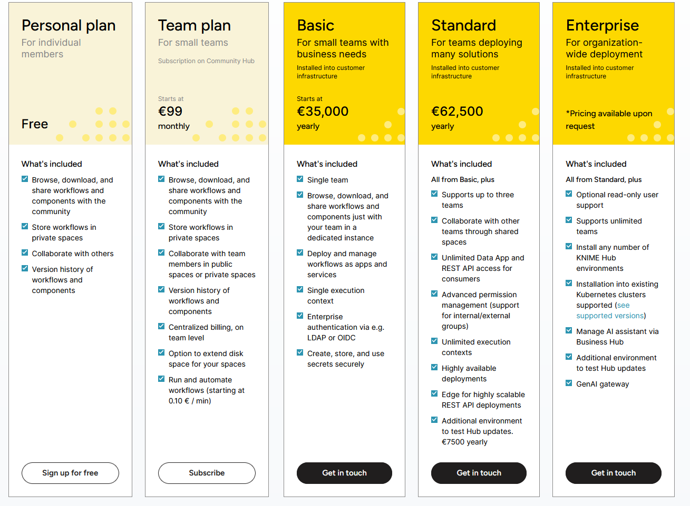

# Käyttöliittymä KNIMEllä (Visio / Idea / Testi)

## Käyttöliittymän toteutus
Käyttöliitymä on mahdollista tehdä myös "Knime Servereillä" jossa käytetään Anaconda ympäristöä.


Kuvassa on esitelty Knimen Nodeja joita käytetään käyttöliittymän toteutuksessa.

Kuvassa on esitelty seuraavat nodet:

* Conda Enviroment Propagation
  * Tarjoaa erilaisia paketteja joita voidaan käyttää pythonissa knimen sisällä esim. Google firebase jne.
* Python Script Node
  * Tämä node on tärkeä koska tämän avulla voidaan kirjoittaa python koodia ja käyttää sitä knimen sisällä,
    tässä tapauksessa kirjoitimme Google Firebase yhdeyden python koodiin jonka avulla saimme kosteus ja lämpötila datan.
  
<details>
<summary><b>Klikkaa noodin sisältämä koodi auki tästä</b></summary>

```python
import pandas as pd
import json
import knime.scripting.io as knio
from google.cloud import firestore
from datetime import datetime

service_account_key_path = r'C:\Users\mruun\Desktop\kerabit-query\kerabit-query\prj-mtp-jaak-leht-ufl-a50dabd764ca.json'

db = firestore.Client.from_service_account_json(service_account_key_path, project='prj-mtp-jaak-leht-ufl')

collection = 'kerabit'

zone_ref = db.collection(collection).document("zone1")
ruuvi_ref = zone_ref.collection("sensor_data_C631F5295273")

docs = ruuvi_ref.stream()
data = []
for i, doc in enumerate(docs):
    if i >= 3:
        break
    doc_dict = doc.to_dict()

    if 'timestamp' in doc_dict and isinstance(doc_dict['timestamp'], datetime):
        doc_dict['timestamp'] = doc_dict['timestamp'].isoformat()

    data.append({
        'SensorData': {
            'id': doc.id,
            'data': doc_dict
        }
    })

json_data = json.dumps(data, indent=4)

output_table = pd.DataFrame({
    "json_data":[json_data]
    })
knio.output_tables[0] = knio.Table.from_pandas(output_table)
print(output_table)
```
</details>

Koodi lukee "service_account_key_path" joka tarjoaa oikeukset kyseiseen Google Firebaseen. Koodi hakee tiedot "kerabit" kokoelmasta ja "zone1" dokumentista ja "sensor_data" kokoelmasta.

Koodi hakee 3 viimeisintä dokumenttia ja muuttaa ne json muotoon ja lopuksi tulostaa ne.
Syy siihen miksi koodi hakee vain 3 viimeisintä dokumenttia johtuu siitä, että on yritetty käyttää vähemmän Google Firebasen read operaatioita niin ei synny ylimääräisiä kustannuksia.

* Table Manipulator
  * Table manipulator noden avulla tehdään tulevasta "String" tuloksesta "JSON taulukko" joka siis laittaa json tiedon yhdelle riville taulukossa.
* Table to JSON
  * Table to JSON noden avulla voidaan muuttaa taulukon tiedot JSON muotoon.
* JSON Path
  * JSON Path noden avulla voidaan hakea tiettyjä tietoja JSON tiedostosta tässä tapauksessa haettiin kaikista tuloksista kaikki "SensorData".
  
    
  Kuvassa haetaan JSON tiedostosta kaikki "SensorData" tiedot.
* Ungroup Node
    * Ungroup noden avulla voidaan purkaa JSON tiedosto ja puhdistaa JSON path nodesta tulevaa tulosta eri sarakkeisiin taulukossa.
      
      Seuraavassa kuvassa esitellään miten tulos näkyy knimessä:

      
* JSON to Table
    * JSON to Table noden avulla voidaan muuttaa JSON tiedosto taulukoksi,
      tässä tapauksessa otetaan kaikki "JSON path" noden tulokset ja pilkotaan ne taulukossa sarakeisiin.
      
      Kuvassa Noden tulos näkyy seuraavasti: 
  
      
* Column Filter
    * Column Filter noden avulla voidaan valita mitkä sarakkeet halutaan näyttää taulukossa, tässä tapauksessa poistettiin JSON sarake koska sitä ei enää tarvita.

        Kuvassa näkyy miten taulukko näyttää ilman JSON saraketta:
    
        
* Missing Value
    * Missing Value noden avulla voidaan poistaa tyhjät arvot taulukosta.
  
        Kuvassa näkyy miten taulukko näyttää ilman tyhjiä arvoja:
    
        
* Python Script node
    * Tämän Python nodel avulla lähetetään Express.js serverille POST kutsu joka lähettää taulukon tiedot JSON muodossa serverille jotta sitä voidaan käyttää käyttöliitymässä.
    
<details>
<summary><b>Klikkaa noodin sisältämä koodi auki tästä</b></summary>

```python
import pandas as pd
import requests
import knime.scripting.io as knio

# Convert Arrow table to pandas DataFrame
df = knio.input_tables[0].to_pandas()

# Print column names and content for verification
print("Column names in DataFrame:")
print(df.columns)
print("DataFrame head:")
print(df.head())

column_name = 'humidity'

for index, row in df.iterrows():
    name = row[column_name]

    payload = {
        'id': row['id'],
        'temperature': row['temperature'],
        'location': row['location'],
        'humidity': row['humidity'],
        'timestamp': row['timestamp'],
        'zone': row['zone']
    }

    # Server End point urli
    url = 'http://localhost:3001/results'

    print(f"Sending request for row {index} with data: {payload}")
    
    try:
        # Lähetä POST kutsu
        response = requests.post(url, json=payload,proxies={"http": None, "https": None}, timeout=10)  # Increased timeout to 5 seconds

        # Tulosta response
        print(f"Response Status Code: {response.status_code}")
        print(f"Response Body: {response.text}")

        # Tarkista Onko Response kunnossa
        if response.status_code == 200:
            print(f"Successfully sent data: {name}")
        else:
            print(f"Failed to send data: {name}")
    
    except requests.exceptions.Timeout:
        print(f"Request for {name} timed out.")
    except requests.exceptions.RequestException as e:
       
        print(f"Request failed for {name}: {e}")

# Knime node Outputti
knio.output_tables[0] = knio.Table.from_pandas(df)
```
</details>

Koodissa käydään läpi taulukon tiedot ja tulokset lähetetään POST kustulla "url = 'http://localhost:3001/results'" osoitteseen joka on Express.js serverin osoite,

tämä voi olla myös erilainen osoite kun ohjelma on tuotannossa.

* Table View
    * Table View noden avulla näytetään Python Script nodesta tullut taulukko.

## KNIME Suunitelman kustannukset
KNIME Serverin kustannukset ovat seuraavat:



Kuvassa on esitelty KNIME Serverin kustannukset, KNIME Serverin kustannukset ovat 0€ - 62,500€ riippuen siitä mitä ominaisuuksia halutaan käyttää.

Jos halutaan käyttää KNIME Serveriä niin kannattaa ottaa yhteyttä KNIME myyntiin ja kysyä tarjous.

Suunitelmassa halvin vaihtoehto serverille on "Basic plan" joka maksaa vuodessa 35,000€ ja sen mukana tulee "Small KNIME Server" joka on tarkoitettu pienille projekteille.

## Standard ja Enterprise
Nämä suunitelmat ovat tarkoitettu suuremmille projekteille ja niiden hinnat ovat 62,500€ ja Enterprisen hintaa voi neuvotella puhelimella.

## Basic 
Tämä suunitelma on tarkoitettu pienille projekteille ja se on halvin vaihtoehto mutta siinä ei tule KNIME serveriä mukana, toki jokainen "Analyysi" joka knimessä automatisoitaan maksaa 0.10€/ minuutti.

Se tarkoittaa siis sitä että jos analyysissä menee aikaa 15 minuuttia niin se tule maksamaan 1.50€ per analyysi.

## Knime Workflows
Knime workflows löytyy täältä: [KNIME_workflows](KNIME_workflows)

## [Edellinen kappale: Sovellusarkkitehtuuri ja käyttöliittymä](Käyttöliittymä.md)
## [Seuraava kappale: Sovelluksen käyttöönotto](../README.md#otto)
## [Takaisin etusivulle](../README.md)