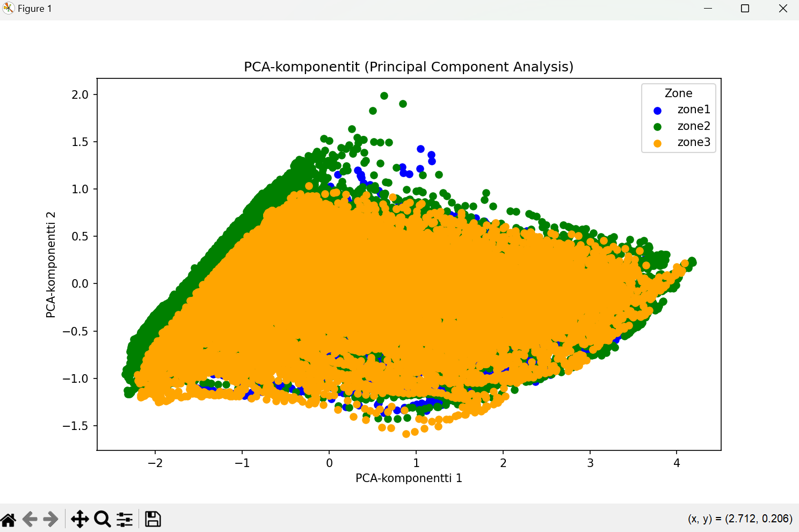
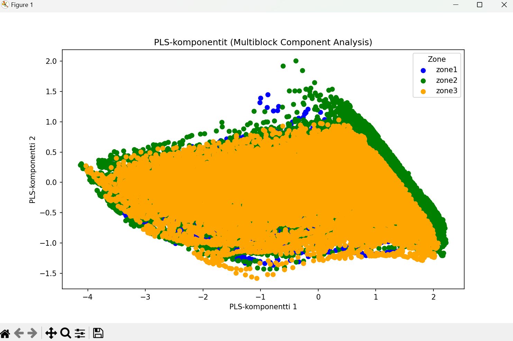
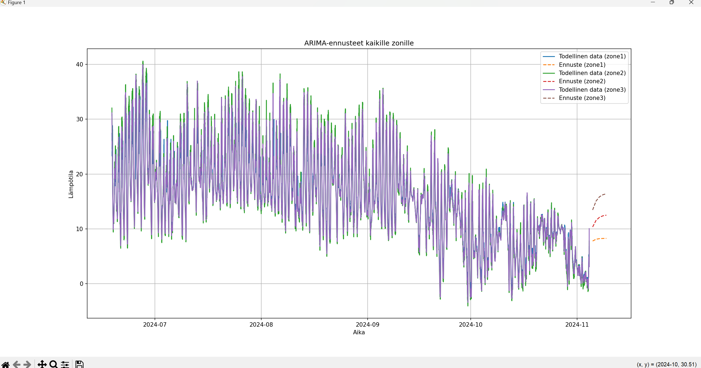
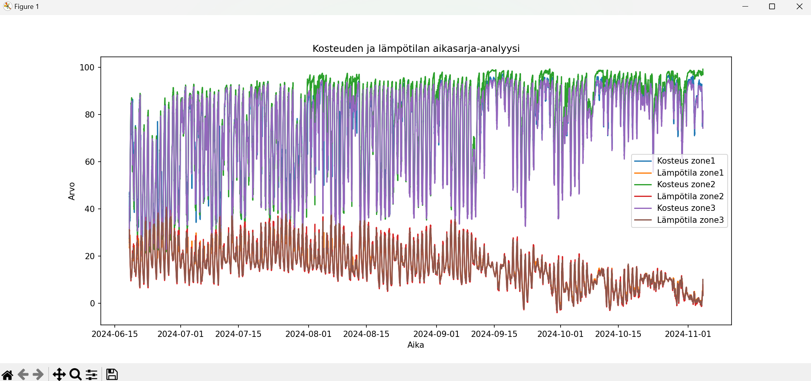
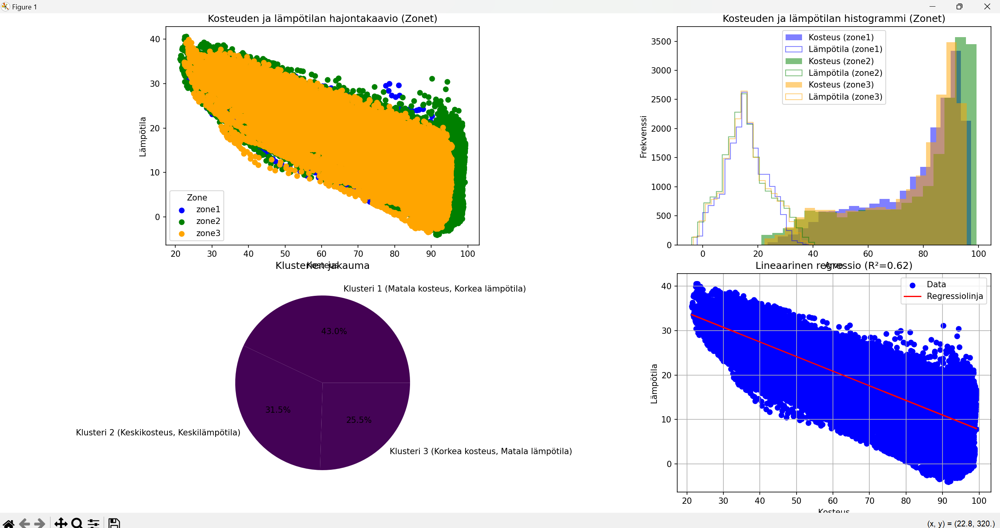

# Data-analyysi Pythonilla

# Aikasarja-analyysi ja Koneoppimismenetelmät

Tässä dokumentaatiossa esitellään prosessi, jossa analysoimme aikasarjadataa kolmelta eri vyöhykkeeltä (`zone1`, `zone2`, ja `zone3`). Datan käsittelyssä käytetään useita koneoppimismenetelmiä, kuten klusterointia (K-Means), pääkomponenttianalyysiä (PCA), lineaarista regressiota, PLS-regressiota, sekä ARIMA-mallia ennusteiden tekemiseksi. Tavoitteena on ymmärtää paremmin lämpötilan ja kosteuden välistä yhteyttä ja tehdä ennusteita.

Dokumentaatioon datayhteyden alustamiseen ja käsittelyyn Pythonilla pääset [tästä](PythonJsoniksi.md).

## Käytetyt Työkalut

- **Pandas**: Datan käsittely ja analyysi
- **Scikit-learn**: Koneoppimismenetelmät (K-Means, PCA, PLSRegression, LinearRegression)
- **Matplotlib**: Visualisointi
- **Statsmodels**: Aikasarjamallit (ARIMA, ADF Test)
- **Google Cloud Firestore**: Datan haku pilvestä

## 1. Datan Haaminen Firestoresta

Datan hakeminen ja yhdistäminen eri vyöhykkeiltä tehdään Firestore-tietokannasta. Aluksi määritellään vyöhykkeet ja alikokoelmat, sitten haetaan kustakin vyöhykkeestä kosteus, lämpötila ja aikaleimat.

### Koodi:

```python
# Firestore alustaminen
service_account_key_path = 'C:\\Users\\melih\\Desktop\\anturiprojekti\\prj-mtp-jaak-leht-ufl-a50dabd764ca.json'
project_id = 'prj-mtp-jaak-leht-ufl'
db = firestore.Client.from_service_account_json(service_account_key_path, project=project_id)

# Zonien määrittely
collection = 'kerabit'
zones = {
    'zone1': 'sensor_data_C631F5295273',
    'zone2': 'sensor_data_C4D912ED63C6',
    'zone3': 'sensor_data_C37E14567097'
}

# Haetaan data Firestoresta
all_data = []
for zone, sub_collection in zones.items():
    sub_collection_ref = db.collection(collection).document(zone).collection(sub_collection)
    docs = sub_collection_ref.stream()
    for doc in docs:
        doc_dict = doc.to_dict()
        doc_dict['id'] = doc.id
        doc_dict['zone'] = zone
        all_data.append(doc_dict)

```

### Osa 2: **Datan Esikäsittely ja Visualisointi**

Kun data on haettu, se muunnetaan Pandas DataFrameksi ja esikäsitellään:

1. Aikaleima muunnetaan datetime-muotoon.
2. Data lajitellaan aikalehden mukaan.
3. Datan visuaalinen esittäminen (kosteus ja lämpötila).

### Koodi:

```python
# Muutetaan timestamp datetime muotoon
df['timestamp'] = pd.to_datetime(df['timestamp'])

# Järjestetään DataFrame aikalehden mukaan
df.sort_values('timestamp', inplace=True)

# Asetetaan timestamp indeksiksi
df.set_index('timestamp', inplace=True)

# Visualisointi kosteuden ja lämpötilan aikasarjoista
plt.figure(figsize=(14, 6))
for zone in zones.keys():
    subset = df[df['zone'] == zone]
    plt.plot(subset.index, subset['humidity'], label=f'Kosteus {zone}')
    plt.plot(subset.index, subset['temperature'], label=f'Lämpötila {zone}')

plt.title('Kosteuden ja lämpötilan aikasarja-analyysi')
plt.xlabel('Aika')
plt.ylabel('Arvo')
plt.legend()
plt.show()

```

---

## 3. K-Means Klusterointi

Tässä osassa data normalisoidaan ja klusteroidaan käyttäen K-Means-menetelmää. Data normalisoidaan StandardScalerilla ja klusterointi tehdään kolmeen klusteriin.

### Koodi:

```python
# Normalisoidaan data
scaler = StandardScaler()
X_scaled = scaler.fit_transform(df[['humidity', 'temperature']])

# K-Means klusterointi
kmeans = KMeans(n_clusters=3, random_state=0)
df['cluster'] = kmeans.fit_predict(X_scaled)

# Klusterien selittävät nimet
cluster_labels = {
    0: 'Klusteri 1 (Matala kosteus, Korkea lämpötila)',
    1: 'Klusteri 2 (Keskikosteus, Keskilämpötila)',
    2: 'Klusteri 3 (Korkea kosteus, Matala lämpötila)'
}

# Korvataan numeeriset klusterit selittävillä nimillä
df['cluster_label'] = df['cluster'].map(cluster_labels)

```

Tässä vaiheessa data klusteroidaan kolmeen klusteriin käyttäen K-Means-algoritmia. Klusterointi tehdään kosteuden ja lämpötilan avulla. Tämän jälkeen klusterit nimetään selittävin nimityksin, jotka helpottavat tulosten tulkintaa.

---

## 4. Pääkomponenttianalyysi (PCA)

PCA-menetelmällä pyritään vähentämään datan ulottuvuuksia ja visualisoimaan tärkeimmät komponentit. Tässä vaiheessa käytetään kaksi pääkomponenttia.

```python
# PCA (Principal Component Analysis)
pca = PCA(n_components=2)
X_pca = pca.fit_transform(X_scaled)

# Lisätään PCA-komponentit DataFrameen
df['pca_comp1'] = X_pca[:, 0]
df['pca_comp2'] = X_pca[:, 1]

# Plotataan PCA-komponentit
plt.figure(figsize=(10, 6))
for zone, color in zone_colors.items():
    subset = df[df['zone'] == zone]
    plt.scatter(subset['pca_comp1'], subset['pca_comp2'], color=color, label=zone)

plt.title('PCA-komponentit (Principal Component Analysis)')
plt.xlabel('PCA-komponentti 1')
plt.ylabel('PCA-komponentti 2')
plt.legend(title='Zone')
plt.show()
```

PCA-menetelmällä voidaan visualisoida datan tärkeimmät piirteet kahdessa ulottuvuudessa, mikä auttaa ymmärtämään datan rakennetta ja erottamaan vyöhykkeet toisistaan.




Kuvassa havainnollistetaan zonien jakautumista eri sijainteihin. PCA- ja PLS-menetelmillä saadut pisteiden sijainnit ovat yhteneviä, mikä todennäköisesti johtuu siitä, että analysoitu data ei ole täysin luotettavaa.

---

## 5. Lineaarinen Regressio

Lineaarinen regressio analysoi kosteuden ja lämpötilan välistä yhteyttä. Tässä vaiheessa rakennetaan regressiomalli kosteuden ja lämpötilan ennustamiseksi.

```python
# Lineaarinen regressiomalli
X_reg = df[['humidity']]
y_reg = df['temperature']
reg_model = LinearRegression()
reg_model.fit(X_reg, y_reg)

# Ennusteet ja regressiotilastot
y_pred = reg_model.predict(X_reg)
r_squared = reg_model.score(X_reg, y_reg)
slope = reg_model.coef_[0]
intercept = reg_model.intercept_
```

Tässä vaiheessa rakennetaan lineaarinen regressiomalli, joka ennustaa lämpötilan kosteuden perusteella. Mallin suoran kulmakerroin ja vakiotermi tulostetaan, ja R²-arvo antaa tietoa mallin ennustetarkkuudesta.

---

## 6. PLS-Regressio

Partial Least Squares Regression (PLSR) käytetään monivaiheisessa analyysissä, jossa on useita riippuvia muuttujia. Tässä mallissa tarkastellaan kosteuden ja lämpötilan välistä yhteyttä.

```python
# PLSRegression
pls = PLSRegression(n_components=2)
X_pls = df[['humidity', 'temperature']]
Y_pls = df[['humidity']]  # Placeholder, multiblock-malli tarvitsee useita riippuvia muuttujia
pls.fit(X_pls, Y_pls)

# Ennusteet ja mallin tarkkuus
y_pls_pred = pls.predict(X_pls)
```

Tässä vaiheessa käytetään PLS-regressiota, joka voi käsitellä useita riippuvia muuttujia ja auttaa löytämään yhteyksiä niiden välillä.





## 7. Aikasarjamallit (ARIMA)

Aikasarjamallien avulla voidaan ennustaa tulevia arvoja. Tässä vaiheessa rakennetaan ARIMA-malli, joka ottaa huomioon trendin ja kausivaihtelut.

### Koodi:

```python
# ARIMA-malli
from statsmodels.tsa.arima.model import ARIMA

# Aikasarjan valmistelu
df_resampled = df.resample('D').mean()  # Päivittäinen keskiarvo

# Rakennetaan ja sovitetaan ARIMA-malli
model = ARIMA(df_resampled['temperature'], order=(5, 1, 0))
model_fit = model.fit()

# Ennusteet
forecast = model_fit.forecast(steps=5)
```

ARIMA-malli on erittäin tehokas aikasarjamallinnuksessa, jossa ennustetaan seuraavat arvot aikaisempien arvojen perusteella. Ennusteet voivat auttaa tulevien arvojen arvioinnissa.

---

Aikasarja ennuste kaikille zoneille
Lämpötila - Aika


Kosteuden ja lämpötilan Aikasarja


Molemmat kuvat tarjoavat mahdollisuuden tarkastella ennusteita reaaliaikaisesti, jolloin zonet on jaoteltu selkeästi eri alueille. Tämä selkeys helpottaa ennustemallien tulosten visualisointia ja tulkintaa. Käyttäjä voi tarvittaessa zoomata tarkastellakseen yksityiskohtia lähempää, ja analyysit voi myös tallentaa myöhempää analysointia varten. Tiedostojen tallennusominaisuus varmistaa, että tärkeät havainnot ovat helposti saatavilla tulevaisuudessa.

### Osa 9: **Yhteenveto ja Tulevaisuuden Suunnitelmat**


Tässä nähdään toteutetut erilaiset analyysit, kuten hajontakaavio, histogrammi, lineaarinen regressio ja klusterointi.

- Hajontakaavio visualisoi muuttujien väliset suhteet ja auttaa tunnistamaan mahdollisia trendejä tai poikkeamia. Se tarjoaa selkeän kuvan siitä, miten data jakautuu ja miten eri muuttujat vaikuttavat toisiinsa.
- Histogrammi näyttää muuttujien jakautumisen ja auttaa arvioimaan datan tiheysjakaumaa. Sen avulla voidaan tunnistaa esimerkiksi normaalijakauman kaltaisia piirteitä tai poikkeuksia.
- Lineaarinen regressio esittää selkeän suhteen riippuvan ja selittävän muuttujan välillä. Tämä malli voi auttaa ennustamaan arvoja ja arvioimaan muuttujien välistä lineaarista yhteyttä.
- Klusterointi puolestaan ryhmittelee datan samankaltaisiin osiin, mikä voi paljastaa piileviä rakenteita ja auttaa ymmärtämään, miten eri havainnot liittyvät toisiinsa.

Nämä analyysit tarjoavat kattavan näkymän datan rakenteesta ja mahdollistavat syvemmän ymmärryksen eri muuttujien välisistä suhteista ja jakautumisista.

## Yhteenveto

Tässä projektissa olemme tutkineet kosteuden ja lämpötilan välistä yhteyttä ja toteuttaneet useita koneoppimismenetelmiä, kuten K-Means-klusterointia, PCA:ta, lineaarista regressiota ja ARIMA-mallia. Olemme oppineet datan rakenteesta ja pystyneet tekemään ennusteita Pythonilla. Jatkotutkimuksena voisimme:

- Parantaa mallin tarkkuutta lisäämällä muuttujia.
- Tutkia syvempää kausivaihtelun vaikutusta lämpötilaan ja kosteuteen.
- Saada datan omistajalta parempaa dataa
- muuttaa tekstien paikkoja
- saada kaikki analyysit samaan ikkunaan

---

Linkki koko koodiin 
https://github.com/Jukaiku/anturidatainno/tree/Backend_Python/anturiPy

## [Python Jsoniksi](PythonJsoniksi.md)
## [Edellinen kappale: Data-analyysi](Data-analyysi.md)
## [Seuraava kappale: Sovellusarkkitehtuuri ja käyttöliittymä](Käyttöliittymä.md)
## [Takaisin etusivulle](../README.md)