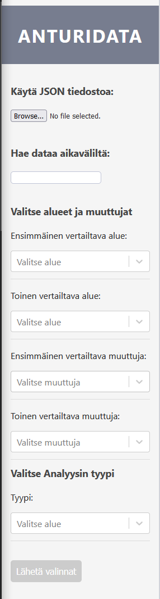
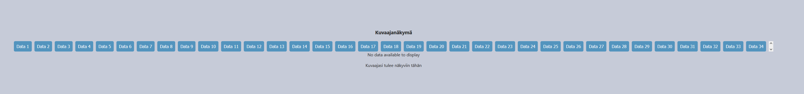
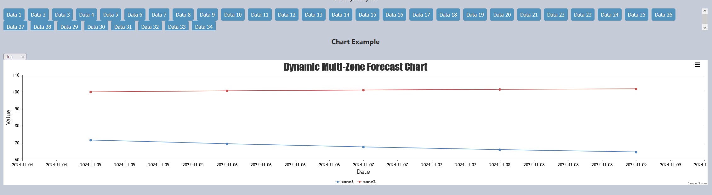
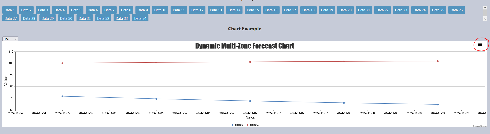
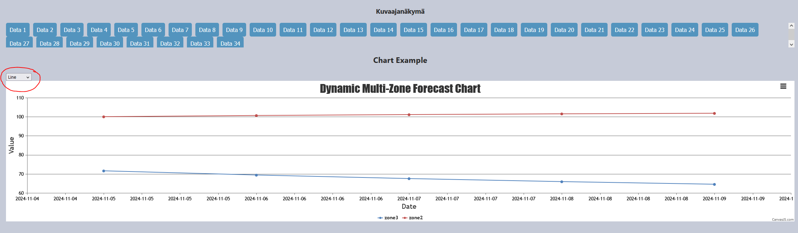

# AnturiData Innovaatio Projekti

Jäsenet: Julia Köykkä, Atte Räisänen, Mikko Tanhola, Kaspar Tullus, Muhammed Özturk

# Sisällysluettelo <a name="sisäl"></a>
1. [Johdanto](#joh)
2. [Projektivaatimukset](#vaat)
3. [Kehitysmenetelmät](#kehmen)
4. [Projektin suunnittelu](#suun)\
    4.1 [Data-analyysi](Doc/Data-analyysi.md)\
    4.2 [Käyttöliittymä](Doc/Käyttöliittymä.md)\
    4.3 [Data-analyysi Pythonilla](Doc/PythonAnalyysi.md)\
    4.4 [Sovellusarkkitehtuuri ja käyttöliittymä](Doc/Käyttöliittymä.md)\
    4.5 [Käyttöliittymä KNIMEllä](Doc/KäyttöliittymäKNIME.md)
5. [Sovelluksen käyttöönotto](#otto)\
    5.1 [Edellytykset](#edel)\
    5.2 [Asennus](#asen)\
    5.3 [Käyttöohje](#käyt)
6. [Yhteenveto](#yht)\
    6.1 [Haasteet](#haast)\
    6.2 [Jatkokehitys](#jatko)\
        &nbsp;&nbsp;&nbsp;&nbsp;6.2.1 [Käyttöliittymän jatkokehitys](#käytjat)\
        &nbsp;&nbsp;&nbsp;&nbsp;6.2.2 [Data-analyysin parannuksia](#datjat)

## Johdanto <a name="joh"></a>

Projektin tavoitteena on tutkia aurinkopaneelien eroja analysoimalla antureiden dataa KNIME-ohjelmistolla ja Python-ohjelmoinnilla. Lisäksi pyritään toteuttamaan React-käyttöliittymä, jonka API yhdistyy Expressin avulla KNIME-palvelimeen. Käyttöliittymän avulla asiakas voi tarkastella dataa, esimerkiksi vertailemalla eri alueiden aurinkopaneelien kosteuden ja lämpötilan tasoja. Projektin aikataulutuksessa noudatetaan ketterää menetelmää ja hyödynnetään Trelloa.

Projektissa käytetyt teknologiat:\
[](#),
[](#),
[](#),
[](#),
[](#),
[](#),
[](#),
[](#),
[](#),
[](#),
[](#),
KNIME analytics platform
## Projektivaatimukset <a name="vaat"></a>

Pääasiallisena asiakasvaatimuksena oli toteuttaa data-analyysi asiakkaan palvelimelle tallennetulle datalle. Asiakasta kiinnosti erityisesti, kuinka kastellun viherkaton sähköntuoton anturidata poikkeaa valkopohjaisen ja mustapohjaisen katon anturidatasta. Opettajan suosituksesta vaatimuksena oli käyttää Pythonin lisäksi data-analysointiin erikoistunutta ohjelmistoa, jonka avulla data-analyysiä voidaan hahmottaa helpommin.

Ohjelmistotuotannon opiskelijoina ryhmän projektivaatimuksena oli myös kehittää web-sovellus, jonka avulla data-analyysiä voidaan tarkastella. Sovellukselle ei kuitenkaan saatu tarkempia asiakasvaatimuksia.

Sovelluksen edetessä projektin painopiste siirtyi Python-pohjaiseen data-analyysiin, koska KNIME-palvelimen analysointi osoittautui liian hintavaksi.

## Kehitysmenetelmät <a name="kehmen"></a>

Projektihallinnassa käytettiin ketterää Scrum-menetelmää. Aikaraja jaettiin kahden viikon jaksoihin, jotka määriteltiin sprintteinä. Kaikissa paitsi ensimmäisessä sprintissä oli Scrum-mestari, jonka tehtävänä on ylläpitää tehtävienhallintaa Trellossa. 

Ketterään työskentelyyn kuuluu Scrum-palaverien aikatauluttaminen. Projektissa pidettiin palavereja tarpeen mukaan, pyrkien pitämään niitä vähintään sprinttien alussa ja lopussa. Projektin versiohallintatyökaluna käytettiin GitHub -etätietovarastoa.

[Linkki työajanseurantaan](https://metropoliafi-my.sharepoint.com/:x:/g/personal/kaspart_metropolia_fi/EaOvk-hq3rlDtGvIea-mcjcBFBH6nMfs9GHBKZcvCcmovw)

[Linkki yksityiskohtaisiin sprintti katsauksiin](SprintReviews/SprintList.md)

## Projektin suunnittelu <a name="suun"></a>

### [Data-analyysi](Doc/Data-analyysi.md)

### [Käyttöliittymä](Doc/Käyttöliittymä.md)

### [Data-analyysi Pythonilla](Doc/PythonAnalyysi.md)

### [Sovellusarkkitehtuuri ja käyttöliittymä](Doc/Käyttöliittymä.md)

### [Käyttöliittymä KNIMEllä](Doc/KäyttöliittymäKNIME.md)

## Sovelluksen käyttöönotto <a name="otto"></a>

### Asennus <a name="asen"></a>

Ensimmäisenä pitää asentaa Node.js ja Python asennusohjeet / asennus löytyvät näiltä sivulta:

[Node.js](https://nodejs.org/en)

[Python](https://www.python.org/downloads/)

#### Pakettien asennus (IntelliJ IDEA)
Ensimmäisenä meijän pitää mennä projektin juureen terminaalissa:
````bash
cd ./anturidata_web
````
Kun ollaan projektin juuressa pitää ladata paketit package.json tiedostosta:

````bash
npm install
````
Tämän jälkeen pitää mennä server kansioon:
````bash
cd ./server
````
Ja ladata serverin paketit package.json tiedostosta:
````bash
npm install
````
Kaiken tämän jälkeen pitää mennä takaisin projektin juureen ja luoda uusi .env tiedosto joka sisältää seuraavat tiedot:
````env
SESSION_SECRET= (session salasana, suositellaan generoimaan SHA256 hashillä)
COOKIE_AGE= (Session cookie ikä, eli kauanko keksi jää käyttäjän koneelle/selaimeen)
MONGO_DB_URI= (MongoDB URI) // tämä voi olla myös firebasen osoite jos kaikki tiedot löytyvät firebasesta jatkokehityksessä mutta tällä hetkellä se voi olla oma mongodb tietokanta
````
Kun kaikki on tehty oikein pitää mennä python koodi kansioon ja asentaa kaikki paketit ja .venv environmentti johon myös asenetetaan kaikki tarvittavat paketit:
````bash
cd ./anturidata_web/server/util/pythonScripts/anturiPy
pip install -r requirements.txt
python -m venv .venv
.venv\Scripts\activate
pip install -r requirements.txt
````
Kun kaikki on asennettu oikein pitää mennä takaisin projektin juureen ja käynnistää client ja server:

Client:
````bash
cd ./anturidata_web
npm run dev
````

Server:
````bash
cd ./anturidata_web/server
npm run dev
````
Nyt sovellus on käynnissä ja voit mennä selaimella osoitteeseen http://localhost:5173

Server puolen tiedot löytyvät osoitteesta http://localhost:3001/results

Server puolen sessioIDt löytyvät osoitteesta http://localhost:3001/track-session


### Käyttöohje <a name="käyt"></a>

Kun kaikki on asennettu oikein ja sovellus on käynnissä, voit mennä selaimella osoitteeseen http://localhost:5173

Käyttöliitymässä on seitsemän eri valikkoa:
1. Käytä JSON tiedostoa - Täällä voit ladata JSON tiedoston joka sisältää anturidataa (HUOM! ei toimi tällä hetkellä, idea jatkokehitykseen)
2. Hae dataa aikaväliltä - Täällä voit hakea dataa tietystä aikavälistä
3. Ensimmäinen vertailtava alue - Täällä voit valita ensimmäisen alueen jota haluat vertailla
4. Toinen vertailtava alue - Täällä voit valita toisen alueen jota haluat vertailla
5. Ensimmäinen vertailtava anturi - Täällä voit valita ensimmäisen anturin jota haluat vertailla
6. Toinen vertailtava anturi - Täällä voit valita toisen anturin jota haluat vertailla
7. Analyysin tyyppi - Täällä voit valita minkä tyyppisen analyysin haluat tehdä



Painamalla Lähetä valinnat käynnistät analyysi prosessin ja saat tulokset näkyviin graafisessa muodossa parin minuutin sisällä.

Seuraavassa kuvassa näkyy analyysi historia, painamalla "Data1,Data2 jne." nappia voit tarkastella tietyn analyysin tuloksia jotka olet tehnyt.



Kun nappia on painettu tulee graafi näkyviin ja voit tarkastella sitä.



Graafissa voi valita minkälaista graaphia haluaa käyttää ja voit myös ladata graafin kuvana.

Graafin lataaminen kuvaksi tapahtuu kuvassa ympäröidyn kohdan kautta.



Graafin tyypin valinta tapahtuu seuravassa kuvassa ympäröidyn kohdan kautta.



Uuden analyysin tekeminen tapahtuu painamalla valitsemalla uudet arvot ja painamalla Lähetä valinnat.

Muista että analyysi voi kestää muutaman minuutin.

## Yhteenveto <a name="yht"></a>

Projekti onnistui, vaikkakin joitakin asioita jäi kesken. Aloitus oli hidasta vaatimusten puutteesta johtuen, mutta tehtävälista saatiin hyvin kasaan, erityisesti data-analyysin osalta. Projektissa on pystytty analysoimaan juuri niitä keskeisiä asioita, ja tiimi on tullut selkeään lopputulokseen, ettei kattojen eroja voida selittää materiaalien eroilla. Datan tarkasteltavuutta käyttöliittymässä voisi parantaa.

### Haasteet

Tiimillä ei ollut aiempaa yhteistyökokemusta, mikä monesti saattaisi nostaa kynnystä kommunikoida. Tästä huolimatta onnistuttiin pitämään aktiivisesti kommunikaatiota yllä. Sovelluksen vastuualuiden jakaminen monelle henkilölle oli haastavaa, sillä selkeitä asiakasvaatimuksia ei ollut. Projektinjäsenten keskuudessa esiintyi useita sairaustapauksia, jotka vaikuttivat projektin etenemiseen. Erityisesti projektinhallinnan ylläpitäminen ja aktiivisena pitäminen oli vaikeaa sairaustapauksien aikana. Samojen komponenttien parissa yhtäaikaisesti työskentely oli haasteellista virhetilanteissa.

### Jatkokehitys <a name="jatko"></a>

#### Käyttöliittymän jatkokehitys <a name="käytjat"></a>

Käyttöliittymään jäi eniten kehittämisen varaa. Jatkokehityksessä sovellusta tulisi testata mobiilikokoisena enemmän, sillä responsiivisuus kuvaajien kanssa ei ole täysin hiottu. Tyylittelyt, kuten `ChartComponent.tsx`-esimerkissä [Käyttöliittymä](Doc/Käyttöliittymä.md) osiossa mainittu, kannattaa upottaa käytettyihin kuvaajiin, ja kuvaajan muuttujakentät tulisi tehdä dynaamisesti mukautuviksi. 

Kuvaajatulosten tallennus eri muodoissa, kuten PDF, JSON tai CSV, on myös tärkeä kehityskohde. Erinomainen idea olisi generoida automaattisesti koneoppimisen avulla lyhyitä tekstikuvauksia kuvaajista, jotka auttaisivat käyttäjää ymmärtämään, kuinka kuvaajaa tulkitaan.

#### Data-analyysin parannuksia <a name="datjat"></a>

Tarkempien ennusteiden laatimiseksi tarvitaan enemmän tietoa olosuhteista sekä pidempiaikaisia mittauksia. Sähköntuotantodatan poikkeuksellisten (matalien ja korkeiden) päivien korostaminen ja niiden tuominen tarkempaan tarkasteluun olisi myös hyödyllistä.
