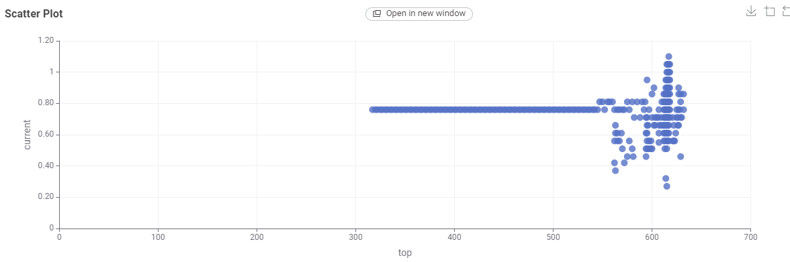

## Sprint 1 Review

Sprintissä käytetty aika: 44 tuntia
Scrum master: -

Ensimmäisessä sprintissä tavoitteena oli aloittaa projektinhallinta luomalla ryhmälle GitHub, Discord ja Trello. Lisäksi tavoitteena oli valita sopiva työkalu datan analysointiin. Ryhmämme päätyi valitsemaan tähän tarkoitukseen KNIME Analytics Platformin.
Aluksi tutustuttiin KNIMEn toimintaan ja kartoitettiin sen mahdollisuuksia projektin tarpeisiin. KNIMEn avulla voitiin tehdä analyysi kahden muuttujan välisistä vaikutuksista. Alustavassa analyysissa käytettiin relevantilta vaikuttavaa testidataa, sillä ei oltu vielä saatu tarvittavia oikeuksia varsinaiseen dataan. Testidatasta ei myöskään löytynyt riittävästi tietoa esimerkiksi aurinkopaneelien käyttötarkoituksista tai toivotuista tuloksista.

### KNIMEn analysointi rakenne

Tässä kuvassa analysoitiin, kumpi puoli aurinkopaneelista on tehokkaampi ja tuottaa enemmän sähköä. Koska testidatasta ei ollut paljon tietoja, oikeaa syytä tähän ei tiedetä.

Toisessa analyysissä tutkittiin, vaikuttaako paneelin paikkatieto sähköntuottoon.

Kuvassa x-akselilla on paneelin top-paikkatieto ja y-akselilla sähköntuotto. Tästä voidaam päätellä, että kun paikkatieto on välillä 300–550, sähköntuotto on tasaista, mutta tätä suuremmilla arvoilla sähköntuotto alkaa vaihdella.

Seuraavaksi haettiin Python-koodilla dataa Google Cloudista KNIMEen ja muunnettiin se JSON-muotoon. KNIMEssä käytetään koodia Python-nodeissa, ja tätä varten piti ladata Anaconda. Anacondalla saatiin paketteja ja Python-ympäristö käyttöön KNIMEssä. Anacondan kautta pystyttiin lataamaan tarvittavia paketteja, joita tarvitaan Google Cloudiin yhdistämiseen.

### KNIMEn Anaconda Paketit -> Python koodi joka tuo dataa "Google CLoudista"

## [Seuraava Sprint](SprintReview2.md)
## [Sprintit](SprintList.md)

