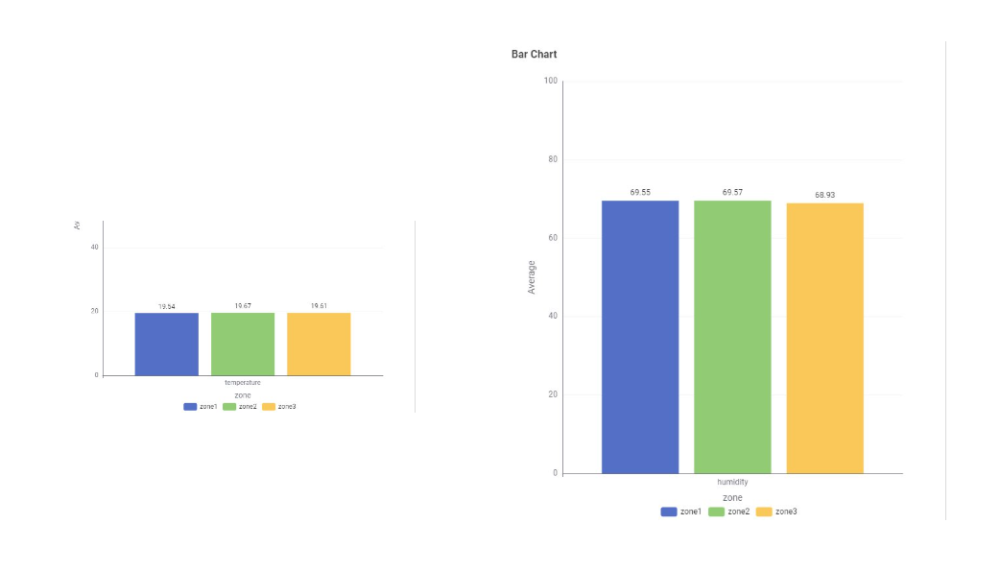
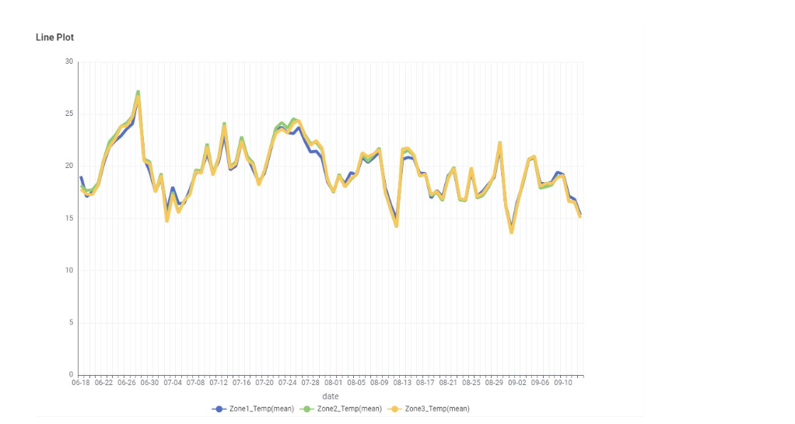
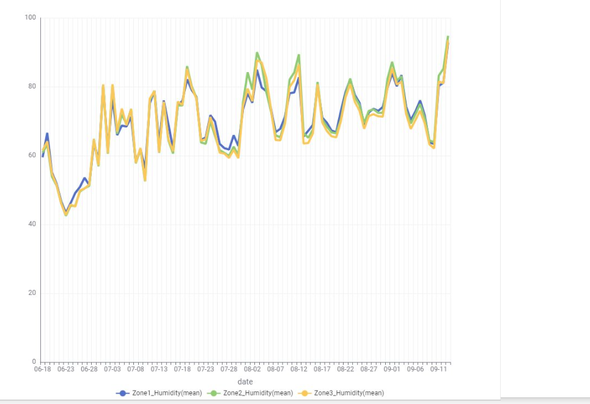
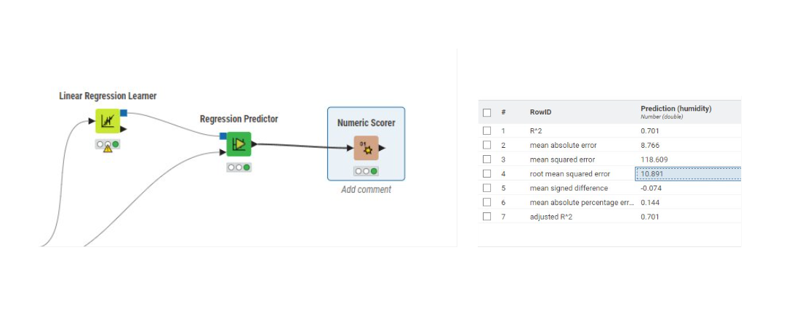

## Sprint 2 Review
Trello Board Kuva, Sprint 2.

Toisessa sprintissä oli tavoitteena analysoida antureista saatua dataa ja alkaa suunnittelemaan käyttöliittymän toteutusta. Saimme tehtyä yksinkertaista analyysiä, mutta vielä jäi sähköntuotto analysoimatta.

kuvasta nähdään zonejen väliset keskiarvot lämpötilalle ja kosteudelle.

Kuvissa näkyvät lämpötilan ja kosteuden keski-arvot päivittäin

Kuvissa näkyy lämpötilan ja kosteuden arvojen jakauma

Kokeilimme myös soveltaa dataan koneoppimismalleja. Kokeilimme saisiko linear regressiolla ennustettua kosteuden arvoja, mutta tulokset jäivät jokseenkin kohtalaisiksi. Mallin perusteella jotain korrelaatiota. Myös decicion treetä kokeiltiin, jos sillä pystyisi ennustamaan zoneja, mutta 60% accuracyllä ei malli näillä parametreilla ole mitenkään järkevä.

### Käyttöliittymän yhteys KNIME palvelimelle

Jotta kaikki toimisi käyttöliittymän kanssa, piti ladata [Anaconda-ecosysteemi](https://www.anaconda.com/), jonka avulla saatiin ladattua KNIMEen erilaisia paketteja, joita voi käyttää Python-koodinodessa KNIMEssä.
Knimessä saatiin tiedot käyttöliittymään hakemalla dataa Google Cloud Firestoresta Python-nodella. Python-nodessa data muunnettiin "Kino"-outputiksi, joka voitiin lähettää analyysinodeihin. Analyysinodejen jälkeen kaikki tulokset lähetettiin uudelle Python-nodelle, joka lähetti POST-kutsulla tiedon ("Tulokset") Express-serverille.

Express-serveri vastaanotti kutsun, myöhemmässä versiossa koitetaan purkaa tieto kutsusta ja tulostaa se käyttöliitymään. Tässä versiossa testattiin vain, että kutsu saapui perille Knimen sisältä "LocalHost"-serverille.

Myös tutkittiin paljonko maksaa KNIME-server, Tuloksena saatiin että jos ohjelma valmistetaan isompaan käyttöön kannatta otta "Knime Business Hub" Paketti joka maksaa 35.000 euroa/vuosi.
Mutta jos on pienempi käyttäjä määrä, niin kannattaa maksaa "Team-plan" jonka hinta on 100 euroa kuukaudessa. Jos halutaan käynnistää analyysi ("Team-plan") sopimuksella "Workflow" Knimessä, se tulee maksamaan 0.10 euroa per minutti kun se workflow pyörii. Workflow pyörii hitaammin mitä enemmän dataa se hakee, eli jos data on iso niin workflown hinta voi nousta korkealle.

Knimen suunitelma hinnat näkyvät sivustossa: https://www.knime.com/knime-hub-pricing

### Käyttöliittymän suunnittelu

Kolmannessa sprintissä valittiin käyttöliittymän ohjelmointikielet ja hahmoteltiin käyttöliittymän toiminnallisuuksia, jotta seuraavassa sprintissä käyttöliittymän rakentaminen voidaan aloittaa.

[Kaavio Google Drivessä](https://drive.google.com/file/d/1e3WuuvXdpVepUh0KZqurkI0zXcseGpl1/view?usp=sharing)

Kuvassa on esitetty sekvenssikaavio.

Sekvenssikaaviosta nähdään tyypillisiä käyttötapauksia:

- Sivu avautuu valikkoon, josta valitaan kuvaajalle visalisoitava data.
- Kuvaajasivulla datan ja kuvaajan tyypin voi vaihtaa.
- Nuolilla voi siirtää kuvaajan ajanjaksoa.
- Kuvaajan datan voi hakea uudelleen.

Perustoiminnallisuuksia on myös hahmoteltu [Figmassa](https://www.figma.com/design/ErpZ9BRxzQFRhu7QXLLNyz/InnovaatioProju?node-id=0-1&t=mHdW0f2nfrnkuPJs-1).
Lisäksi on alustavasti mietitty lisätoiminnallisuuksia, kuten tulosten tallentaminen (PDF/CSV-muotoon) ja interaktiivinen datan tutkinta.

### Analyysi Pythonilla

Tavoitteena tarkistaa tuleeko samat tulokset Pythonilla

Kaikki kaaviot sisältävät reaaliaikaisesti zone 1, 2 ja 3.

Kuvissa näkyy:

- **Kosteuden ja lämpötilan hajontakaavio**
- **Kosteuden ja lämpötilan histogrammi**
- **Klusterointikaavio**
- **Lineaarinen regressio: Kosteus vs Lämpötila**  
  Regressiosuoran R²-arvo: `0.67`, kun Knimellä saavutettiin `0.7`.

käytettiin seuraavia Python-kirjastoja:

- **pandas**: Datan käsittelyyn ja esikäsittelyyn
- **numpy**: Matemaattisiin laskutoimituksiin
- **matplotlib** ja **seaborn**: Visualisointien, kuten hajontakaavioiden ja histogrammien, piirtämiseen
- **sklearn (scikit-learn)**: Klusterointiin ja lineaariseen regressioon
  - **KMeans**: Klusterointiin
  - **LinearRegression**: Lineaariseen regressioon

Tulokset olivat lähellä KNIME:llä saatuja, mutta eroavaisuudet olivat helposti havaittavissa. Esimerkiksi pisteet eivät olleet täysin samoilla kohdilla.

## [Seuraava Sprint](SprintReview3.md)

## [Sprintit](SprintList.md)
