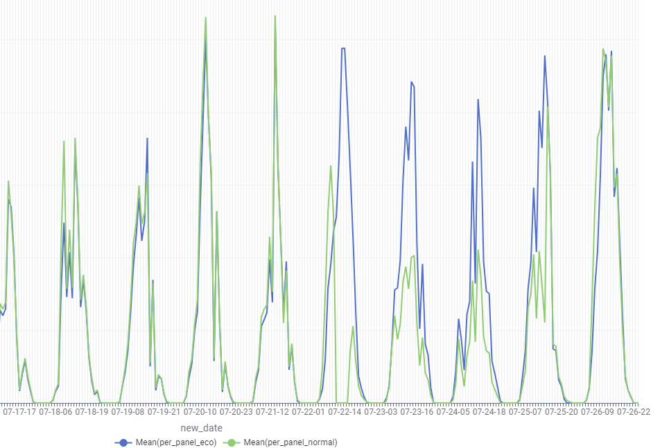
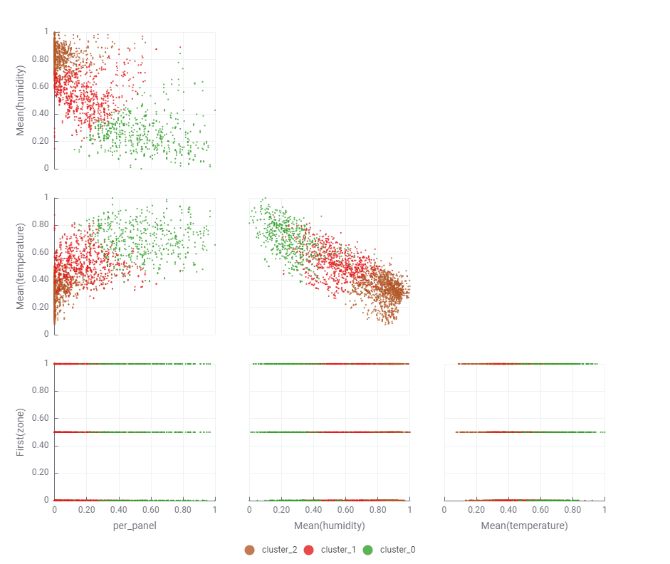

## Sprint 3 Review

Kolmannessa sprintissä oli tavoitteena jatkaa MOCA analyysia, PCA analyysia, selkeyttää ecokaton datan eroavaisuuksia, sekä aloittaa REACT sivun tekeminen aikaisempien suunnitelmien perusteella.

### KNIME analyysi

Yhdistettiin sähköntuottoa analyysiin mukaan. Sähköntuottodataa oli vain kahdelta kuukaudelta: heinä- ja elokuulta, joten analyysi ei ole hirveän kattava, eikä tuloksista näy esim. kausien vaikutusta sähköntuottoon. Myös yksittäisten paneelien sähköntuottoa ei ollut saatavilla, joten kattojen välisiä eroja analysoitaessa on käytetty keskiarvoa kaikkien paneelien tuotosta(tuotto/paneelien määrä). 

tässä näemme eri kattojen tuottoa. Voimme havaita, että 22-25.5 tuotto on ekokatolla ollut parempaa, mutta muina aikoina tuotot ovat lähes samaa luokkaa.

Teimme PCA-analyysiä knimellä, joka sijoitteli annetut arvot klustereihin. Tästä analyysistä voimme havaita, ettei tämän analyysin avulla zonejen välillä havaita suuria eroja. 

### Käyttöliittymä

Tehtiin React-kirjastolla ja TypeScript ohjelmointikielellä ensimmäinen versio käyttöliittymästä. Käyttöliittymässä on kalenteri elementti, josta määritellään ajanjakson, jolta dataa haetaan.

Kalenteri elementti käyttää **React-date-range** -kirjastoa. Kalenteri näyttää kaksi kuukautta vierekkäin, jotta käyttäjä voi helposti valita ajanjakson laajalta aikaväliltä. Päivämäärät voi valita alusta ja lopusta, minkä jälkeen käyttöliittymä lähettää valitut päivämäärät muuhun logiikkaan kuvaajia varten. Kalenteri elementti ei vastaa vielä lopullista versiota.

Käyttöliittymässä on kaksi erillistä monivalintalaatikkoa, joissa käyttäjä voi valita zone-alueen ja sen muuttujat (esim. kosteus ja lämpötila). Monivalintalaatikko elementit käyttävät **React-select** -kirjastoa. Parannuksia monivalintalaatikoihin tehdään seuraavassa sprintissä.

### Multiblock component analyysi pythonilla
 

tehtiin analyysi käyttämällä Partial Least Squares Regression (PLSRegression) -luokkaa, joka on osa scikit-learnin (sklearn.cross_decomposition) kirjastoa.

X on selittävien muuttujien matriisi (tässä tapauksessa kosteus ja lämpötila).

Y on riippuvien muuttujien matriisi (kosteutta placeholderina).

## [Seuraava Sprint](SprintReview4.md)

## [Sprintit](SprintList.md)
