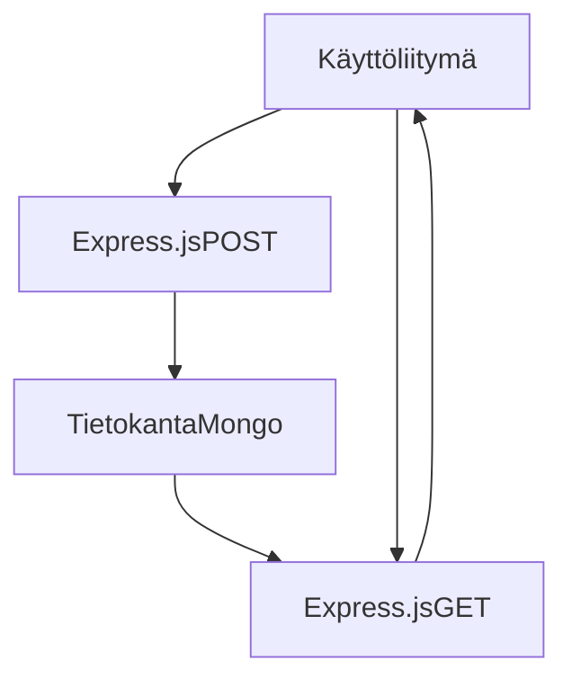
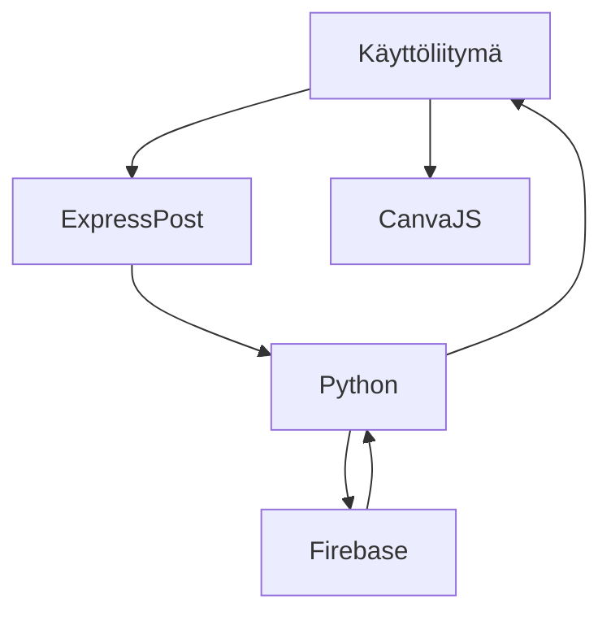

## Sprint 5 Review

Sprintissä käytetty aika: 99 tuntia

Scrum master: Atte Räisänen

Sprintissä 5 keskityttiin erityisesti käyttöliittymän kehitykseen. Työn aikana selvitettiin muun muassa seuraavat asiat:
- Mitä grafiikoita käytetään analyysien visualisointiin.
- Miten data tulisi vastaanottaa ja lähettää käyttöliittymässä ja sen kautta.

### Käytetyt teknologiat

Käyttöliittymän kehityksessä otettiin käyttöön seuraavat teknologiat:

- **Express.js**
- **CanvasJS**
- **TypeScript**
- **ESLint**
- **React.js**
- **Python**
- **JavaScript**
- **MongoDB**
- **Firebase**
- **Google Cloud**

### UML-kaaviot

#### Käyttöliittymän ja tietokannan vuorovaikutus
Alla on käyttöliittymän ja tietokannan vuorovaikutusta kuvaava UML-kaavio:



#### Käyttöliittymän ja Pythonin välinen toiminta

Seuraavassa UML-kaaviossa havainnollistetaan käyttöliittymän ja Pythonin välistä toimintaa:


Backendissä suunniteltiin Pythonin ja Node.js
välinen toiminta Express.js POST -pyyntöjen sisällä. Toiminnan kulku on seuraava:

1. Kun käyttäjä tekee valinnan, Python-koodi käynnistää tarvittavat analyysit.
2. Analyysien tulokset palautetaan käyttöliittymään.
3. Tulokset tallennetaan myös MongoDB-tietokantaan, jotta aiemmat analyysit pysyvät tallessa.

### Express.JS idea ja toimminnalisuus

Express.js valittiin backend-teknologiaksi, koska se tarjoaa SessionID-ominaisuuden, joka yksinkertaistaa käyttäjähallinnan toteutusta.

- SessionID tallennetaan selaimen kekseihin (cookies).
- Jos käyttäjä palaa myöhemmin sivulle, hänellä on edelleen sama SessionID tallessa.
- Jos käyttäjä puhdistaa selaimen keksit, SessionID vaihtuu, jolloin aiemmin tehdyt analyysit eivät enää näy käyttäjälle.
- Tämä järjestelmä varmistaa, että jokainen käyttäjä saa vain omat analyysituloksensa eikä pääse käsiksi muiden tietoihin.
    
Kuva MongoDBstä jossa tallennettu ARIMA analyysin tulokset SessionID käyttäen:


Tässä esimerkki gifissä näytetään mistä SessionID tulee ja miltä keksi näyttää josta se otetaan: 
[](https://gyazo.com/a490f73883c8cb233bed46994804d064)

## Python Analyysit Json tiedostoksi


### 1. Datan hakeminen

Haetaan dataa useista lähteistä:

- **Firestore**: Käytetään `google.cloud.firestore`-kirjastoa Firestore-tietokantaan yhdistämiseen. Haetaan sensoridataa useilta "zoneilta", jotka tallennetaan pandas DataFrameen.

### 2. Datan muokkaus ja järjestely

- Sensoridatan muuttujat (esim. lämpötila ja kosteus) muunnetaan sopivaan muotoon:
  - **Timestamp** muunnetaan datetime-muotoon ja asetetaan indeksiksi.
  - Tietueet lajitellaan aikaleiman mukaan.

### 3. Analyysit

Suoritetaan useita analyyseja datasta:

- **K-Means-klusterointi**:
  - Sensoridatan muuttujat (`humidity`, `temperature`) normalisoidaan `StandardScalerilla`.
  - K-Means luo 3 klusteria, jotka lisätään DataFrameen.

- **PCA (Principal Component Analysis)**:
  - Suoritetaan PCA-analyysi ja tallennetaan pääkomponentit DataFrameen.

- **PLS (Partial Least Squares Regression)**:
  - Sovitetaan PLS-regressiomalli lämpötilan ja kosteuden välille.
  - Mallin tulokset tallennetaan pääkomponenttien muodossa.

- **Lineaarinen regressio**:
  - Suoritetaan lineaarinen regressio kosteuden ja lämpötilan välille.
  - Lasketaan R²-arvo, kulmakerroin ja vakiotermi.

- **ARIMA-aikasarja-analyysi**:
  - Jokaiselle "zone"-alueelle sovitetaan ARIMA-malli lämpötiladatan ennustamiseksi.
  - Tallennetaan mallin ennusteet, AIC- ja BIC-arvot.

### 4. Tulosten tallennus JSON-muotoon

- Kaikki analyysin tulokset tallennetaan yhteen rakenteeseen:
  - K-Means-klusterit
  - PCA-analyysin selitysaste ja komponentit
  - PLS-mallin pisteet
  - Regressiomallin parametrit
  - ARIMA-mallien ennusteet ja arviointimetriikat

- Rakenteen avaimet muunnetaan merkkijonoiksi JSON-yhteensopiviksi.

- JSON tallennetaan tiedostoon:
  ```python
  output_path = 'Tulokset.json'
  with open(output_path, 'w') as f:
      json.dump(results_json_ready, f, indent=4)
  ```

## [Seuraava Sprint](SprintReview6.md)
## [Sprintit](SprintList.md)
