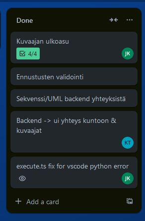
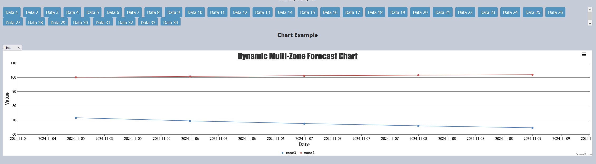
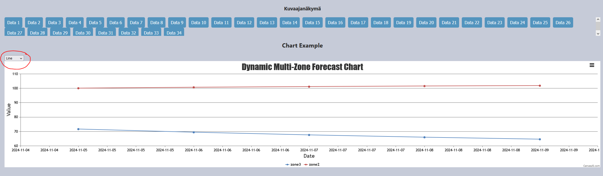
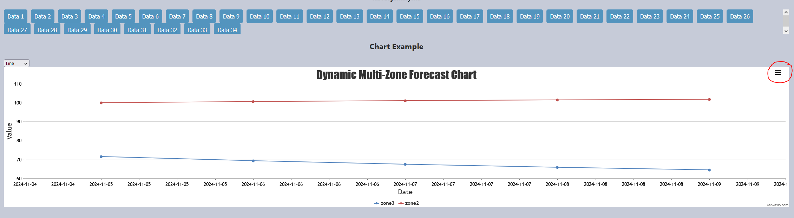

## Sprint 6 Review

Sprintissä käytetty aika: 101 tuntia

Scrum master: Julia Köykkä

Sprintissä 6 keskityttiin erityisesti käyttöliittymän kehitykseen.

### Mitä kehitettiin
Tavoitteena oli saada käyttöliittymä toimintavalmiuteen demoa varten.

Käyttöliitymään lisättiin uusia ominaisuuksia, kuten:

* Analyysityypin valinta
* Tulosten näyttäminen graafisesti
* Kuvaajien tallentaminen kuvatiedostona
* Erilaisten kuvaajien valinta
* Tulosten historian tallennus
* Tulosten hakeminen express.js kautta

### Analyysityypin valinta
Ennen kuin analyysi voidaan tehdä, käyttäjän pitää valita analyysityyppi. Tällä hetkellä vaihtoehtoja on kaksi: "Time Series" ja "ARIMA".

Kun käyttäjä on valinnut analyysityypin, analyysi suoritetaan ja tulos näytetään käyttäjälle kuvaajana.

Kuvassa nähdään tulos "Arima" analyysistä.

### Historia data
Kun käyttäjä suorittaa analyysin, sen tulos tallennetaan historiaan. Käyttäjä voi myöhemmin tarkastella tallennettuja tuloksia historiasta ja nähdä ne kuvaajana painamalla "Data"-painikkeita, jotka näkyvät aiemmassa kuvassa.

Analyysitulokset tallennetaan tietokantaan yhdessä "SessionID"-tiedon kanssa. Tämä mahdollistaa sen, että tulokset voidaan yhdistää oikeaan käyttäjään ja hakea käyttäjäkohtaisesti.

### Kuvaajatyylin valinta

Kuvaajalle lisättiin myös mahdollisuus valita esitystyyli, eli käyttäjä voi päättää, minkä näköisenä kuvaaja esittää tulokset.

Kuvaajatyylin vaihtopainike on ympyröity seuraavassa kuvassa punaisella:

### Kuvaajan tallentaminen kuvatiedostona

Kuvaajan voi tallentaa kuvatiedostona ja sen tallennuspainike on ympyröity seuraavassa kuvassa punaisella:

## [Seuraava Sprint](SprintReview7.md)
## [Sprintit](SprintList.md)
