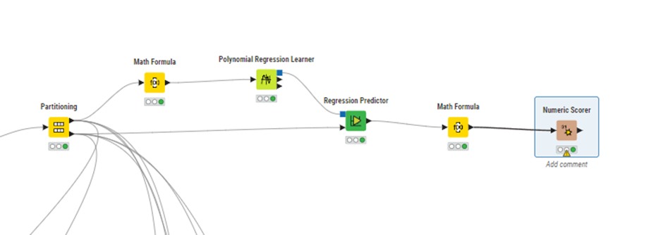
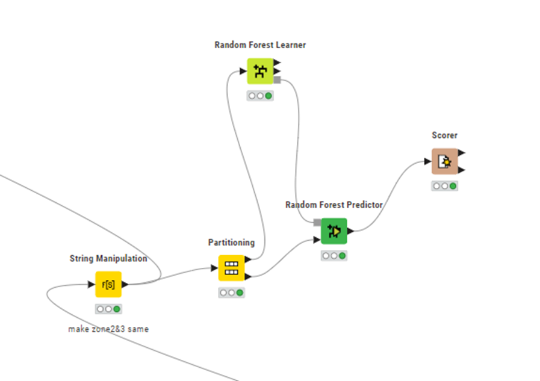

# Analyysi

Tämän analyysin tarkoituksena on analysoida anturidataa kosteudesta ja lämpötilasta yhdistettynä aurinkopaneeleiden sähköntuottoon. Paneelit ja anturit ovat sijoitettu samalle katolle, mutta katon materiaalissa on eroja. Tavoitteena on Saada selville, onko niin sanotulla ecokatolla vaikutusta sähköntuottoon. 
Datan analysointiin käytettiin KNIME Analytics Platformia. Anturidata saadaan ohjelmaan käyttämällä JSON Reader nodea ja sähköpaneeleiden tuotto saadaan käyttämällä Exel Reader nodea. 

## Datan alustus

### Anturidata:

JSON Path, Ungroup, Column Filter nodet, käytetään Jsonin muuttamiseen Knime-taulukoksi. Joka näyttää seuraavalta:

Row filterillä erotetaan zonet, niin että zone1 (ecokatto) ja zonet 2 ja 3 (normaali katto) erotetaan eri taulukoiksi.  String replacerilla lisätään yksi sarake taulukkoon joka kertoo onko katto ecokatto vai ei. 
String manipulation, column combiner ja column renamer nodeilla parsetaan timestampista päivämäärä ja tunti uudeksi “date” sarakkeeksi. 
Row filter nodella yhdistetään zone2 ja zone3 samaan taulukkoon keskenään, jotta voidaan lisätä sähköntuotto oikeisiin arvoihin. 
Group by nodella otetaan keskiarvot lämpötilasta ja kosteudesta joka tunnin välein. 

### Sähködata

String manipulation nodeilla parsetaan timestamp erillisiksi sarakkeiksi: päivä, kuukausi, tunti. Missing Value nodella asetetaan puuttuvat arvot nolliksi. Column combiner nodella yhdistetään päivämäärä uudeksi sarakkeeksi, joka on samanlainen, kuin sama sarake anturidata taulukossa. Tätä päivämäärä saraketta käyttäen yhdistämme taulukot. 
Group by nodella otetaan keskiarvo sähköntuotosta tunnin välein, jotta se vastaa anturidatan aikaväliä. 
Expression nodella otetaan keskiarvo sähköpaneeleiden sähköntuotosta, koska ei ollut saatavilla vain yhden paneelin tuottoa. 

Joiner nodella yhdistetään sähködata anturidataan ja concatenate nodella yhdistetään taulukot, jotka sisältävät ecokaton ja normaalin katon yhdeksi taulukoksi. Lopulta saadaan taulukko, joka näyttää seuraavalta: 

Taulukossa on sarakkeet:  rowID, päivämäärä, päivä, kuukausi, tunti, sähköntuotto(per paneeli), kosteus, lämpötila ja zone. 

Tarkastellaan sähköntuottoa: 

Kokonaistuotto (sum) koko ajalta on ecokatolla pienempi verrattuna normaaliin kattoon. 

Tuntikohtaisesta kaaviosta havaitaan kuitenkin, että ecokatto tuottaa enemmän klo.12-18 välillä. Voimme päätellä tästä, että ecokatolla saattaa olla päivällä optimaalisemmat olosuhteet sähköntuoton kannalta. 

## Statistical hypothesis testing/Linear Regression alanyysi

Nollahypoteesi: lämpötila ja kosteus ei vaikuta sähköntuottoon.
Tutkitaan vuorovaikutusta linear regression avulla

Ensimmäisessä kuvassa on käytetty parametreina pelkästään lämpötilaa, tokassa kosteutta ja viimeisessä molempia. 
Näemme t-arvosta, että kun lämpötila on korkeampi, niin myös sähköntuotto on korkeampaa, ja taas kun kosteus on matalampi, niin sähköntuotto on korkeampaa.
P-arvo on selkeästi alle 0.05, joten voimme hylätä nolllahypoteesin ja todeta, että lämpötilan ja kosteuden vaikutus sähköntuottoon on tilastollisesti merkittävää.

Käytetään seuraavaksi Regression predictor nodea Knimessä ennustamaan sähköntuoton arvoja. 

Normalisoidaan käytettävien parametrien arvot välille 0-100 ja käytetään partitioning nodea asetuksella 80-20 %, opettamaan regression learner algoritmia. Regression predictor nodella yritetään ennustaa sähköntuoton arvoja saadun algoritmin avulla. 
Käytetään Numeric Scorer nodea arvioimaan, Kuinka hyvä malli on ennustamaan arvoja. 

R^2 arvo kuvaa, Kuinka hyvin lämpötila ja kosteus selittävät varianssia sähköntuotossa. Arvo on noin 0.5, joten voimme todeta, että on oltava muita muuttujia, jotka vaikuttavat sähköntuottoon, ja vaikka lämpötila ja kosteus selkeästi vaikuttavat siihen, eivät ne pysty yksin selittämään sähköntuoton vaihtelua. Jotta pystyisimme tarkasti ennustamaan sähköntuottoa tällä mallilla, niin tarvitsisimme enemmän muuttujia, jotka vaikuttavat sähköntuottoon. 

Käytetään vielä lisäksi linear correlation nodea tulosten vahvistamiseksi.

Linear correlation node kertoo myös, että lämpotilalla ja kosteudella on kohtalaista vaikutusta sähköntuottoon, ja saamme myös tästä nodesta p-arvoksi alle 0.05. Tämä varmistaa jo linear regression avulla saatuja tuoloksia. Korrelaatiotaulukosta voidaan myös nähdä, että kosteus näyttää vaikuttavan hieman enemmän sähköntuottoon. Kosteuden korrelaatio arvo on negatiivinen, joten kun kosteus laskee, niin sähköntuotto yleisesti nousee. Lämpötila taas vaikuttaa positiivisesti sähköntuottoon eli lämpötilan noustessa, sähköntuottokin nousee. 

Voimme hieman parantaa linear regression mallia käyttämällä sähköntuoton parametrille sen luonnollista logaritmia ja käyttämällä polynomial regression learneria havaitsemaan monimutkaisempia korrelaatioita datassa. 

Käytetään math formula nodea muuttamaan sähköntuoton arvot niiden luonnoliseksi logaritmiksi. 

Käytetään samaan tyyliin regression learner ja prediction nodeja. Lopuksi muutetaan ennustetut arvot “normaaleiksi” math formula noden exponenttifunktion avulla.

Kun verrataan saatuja tuloksia linear regression, saadaan polynomial regression avulla hieman parempia tuloksia. R^2 arvo on 0.67, joten malli selittää noin 67% sähköntuoton varianssista. Mean absolute error ja mean squared error myös ovat pienempiä, joka viittaa parempaan malliin. Kuitenkin tämäkin malli jättää vielä paljon selittämättä. 

## Clustering analyysi ja anomaly detection

Selvitetään, voidaanko löytää datasta selkeitä ryhmittymiä tai muusta datasta paljon poikkeavia tuloksia. 

Käytetään klusterointiin optimized k-means nodea, joka laskee parhaan klusterien määrän datan ja silhouette coefficientin avulla. Ennen klusterointia tehdään datalle PCA eli principal component analysis käyttäen PCA nodea. Tämä vähentää datan dimensioita ja auttaa k-means algoritmia saavuttamaan parempia tuloksia. PCA nodeen otetaan parametreiksi lämpö, kosteus ja sähköntuotto. Valitaan asetukseksi 3 dimensiota, sillä usein 2 dimensiota riittää, joten otetaan yksi ylimääräinen varmuuden vuoksi.  Silhouette coefficient nodeen otetaan mukaan parametreiksi myös lämpö, kosteus ja sähkö, mutta myös PCA noden antamat dimensiot sekä zone, jotta saadaan mahdollisimman paljon muuttujia huomioitua. 

Optimized k-means antaa yllä olevan taulukon joka kertoo, optimaalisen klusterien määrän dataan. Voimme havaita, että datan perusteella optimaalinen määrä klustereita on 2 sillä, kahdella klusterilla on suurin silhouette coefficient. Voimme jo tämän perusteella pääetellä, ettei datassa synny annetuilla parametreillä selkeitä klustereita. Tarkastellaan vielä visuaalisesti tuloksia. 

Kuvassa on kosteuden, lämpötilan ja sähköntuoton pistekaaviomatriisi. Väridimensioina on saadut klusterit. Voimme havaita kuvasta, että algoritmi on laittanut datan vain noin keskeltä puoliksi, eikä selkeitä klustereita datasta synny. 
Tarkastellaan vielä zonejen välisiä eroja:

Kuvissa väridimensioksi vaihdettu zonet 3, 2 ja 1 järjestyksessä. Kuten voimme havaita, ei zonejen välillä datapisteissä ole merkittäviä eroja. 
Voimme analyysin perusteella sanoa, että datasta ei löydy selkeitä klustereita tai keskittymiä, jotka voisivat selittää varianssia muuttujissa. 

Katsotaan seuraavaksi voidaanko löytää  datapisteitä, jotka eroavat muusta datasta merkittävästi klusteroinnin avulla.

Käytetään string to number nodea tekemään halutuista sarakkeista numeroita visualisoinnin helpottamiseksi. Käytetään normaalia k-means nodea asetuksella 3 klusteria ja cluster assigner nodella asetetaan riveille saadut klusterit. Saadut klusterit näyttävät seuraavalta: 

Kuten optimized k-meansillakin saadut klusterit, myös nämä näyttävät olevan vain suunnilleen data laitettu kolmeen yhtä suureen osaan. Tarkastellaan löytyykö. Poikkeavuuksia. 

Yhdistetään k-means noden toisesta ulostulosta klustereiden keskuskohdat muuhun dataan. Math formula nodella lasketaan jokaisen rivin etäisyys klusterin keskuspisteestä kaavalla sqrt( (keskuspisteen x – rivin x)^2 + (keskuspisteen y – rivin y)^2 + (keskuspisteen z – rivin z)).  Group by nodessa valitaan cluster sarake ja manual aggregation välilehdeltä valitaan edellsisessä math formula nodessa luotu etäisyys klusterin keskuksesta sarakkeiksi. 

Valitaan asetuksista haluttu quantile, tässä on käytetty 0.025 ja 0.975 eli arvot jotka poikkeavat 5% kaikesta muusta datasta. 

Saadaan taulukko, jossa on jokaisen klusterien arvot , jotka ovat pienimmät ja suurimat 1%. 
Joiner nodella yhdistetään nämä sarakkeet datataulukkoon. 
Rule engine nodella erotellaan rivit, jotka ovat pienempiä kuin 0.025 arvo tai suurempia, kuin 0.975 arvo. 

Asetetaan uusi sarake, joka on 0 tai 1 riippuen, onko rivi poikkeava vai ei. 
Seuraavaksi pystymme vislualisoimaan poikkeavia arvoja. 
Näillä parametreillä löyi 156 riviä, jotka täyttävät ehdot. 

Edellä olevassa kuvaajassa datapisteet jotka poikkeavat normaalista

Tästä kuvaajasta nähdään, että poikkeavuuksia on hieman enemmän heinäkuussa. 

Tästä kuvaajasta nähdään, että ensimmäisessä klusterissa on eniten poikkeavuuksia. Tämä voi johtua siitä, että data ei sovitu hyvin klustereiksi, kuten jo aiemmin näimme. 

Tässä kuvaajassa on jaoteltu poikkeamat kellonajan mukaan. Näemme tästä, että poikkeamat jakautuvat jokaiselle kellonajalle, mutta kelle 14-15 niitä on selkeästi eniten. 

Tässä kuvaajassa on sähköntuotto, kosteus ja lämpötila kaikilta poikkeusriveiltä. Kaavasta voidaan nähdä, että poikkeustilanteissa sähköntuotto ja kosteus vaihtelevat enemmän, kuin lämpötila. 

Kuten kaavoista näemme, poikkeustilanteet jaoittuvat tasaisesti, mutta hieman enemmän klo. 12-15 välille ja niihin näyttäisi liittyvän suuret kosteuden ja sähköntuoton vaihtelut. Jotta voisimme selittää vaihteluita kosteudessa, tarvitsisimme enemmän tietoa sääolosuhteista. 

## Machine learning models

Selvitetään voisiko dataan soveltaa machine learning modeleita, joita löytyy knimestä. Kokeillaan MLP ja Random forest algoritmeja.

Valitaan column filterillä datasta vain sähköntuotto, lämpötila ja kosteus. Normalisoidaan data 0-1 välille, jotta algoritmi toimii oikein. Käytetään partitioning nodea, erottamaan testidata ja opetusdata. MLP learner nodessa laitetaan asetuksiksi 500 iteraatiota, 10 hidden layers ja 25 hidden neurons per layer. Valitaan class columniksi sähköntuotto. Predictor nodella ennustetaan sähköntuottoa saadun mallin avulla.

Saamme samankaltaisia tuloksia linear regression malliin nähden: R^2 on 0.5 ja mean absolute error on noin 13%.
Voimme todeta, että tämä malli ei sovellu kovinkaan hyvin ennustamaan dataamme. 

Kokeillaan voidaanko ennustaa zoneja Random forest- algoritmin avulla.  

Random forest agoritmi ei tarvitse normalisointia. Käytetään String manipulation nodea, jolla lisätään sarake, jossa on yhdistetty zonet 2 ja 3 yhdeksi zoneksi, sillä ne ovat ominaisuuksiltaan identtisiä ja haluamme selvittää pystyykö algoritmi ennustamaan ecokattoa annetuista parametreistä. Käytetään taas partitioning nodea jakamaan data testi ja opetusdataan. Random forest learner nodessa otetaan parametreiksi kaikki mahdolliset parametrit: kuukausi, päivä, tunti, lämpötila, kosteus ja sähköntuotto. 
Tarkastellaan scorer nodella tuloksia: 

Ensimmäisessä kuvassa on confusion matriisi, josta nähdään ennustukset. Tilastoista näemme, että algoritmi ennustaa zone3:a noin 70% tarkkuudella oikein ja zone1:tä noin 50% tarkkuudella oikein saaden yhteensä noin 0.67% tarkkuuden. Mielestäni tämä malli ei saavuta tavoitteita tarkoituksiimme, sillä haluaisimme ecokaton ennustuksen olevan tarkempi. 

## Time Series -analyysi
Osana data-analyysiä päätimme tutkia erilaisia ennustusmalleja ja niiden soveltuvuutta sähkötuotannon kehityksen ennustamiseen. Tutkimistamme malleista päädyimme käyttämään Vector autoregressionia (VAR).

Validoinnin perusteella VAR-analyysi tuotti osittain tarkkoja tuloksia, mutta eroavaisuuksia oikeiden sähkötuotantolukemien ja ennusteiden välillä oli huomattava määrä. Tämän lisäksi sähkötuotantojen suuri ero elokuun ja syyskuun välillä (80% pudotus sähkötuotannossa) teki ennustuksesta haastavaa. Emme löytäneet dataan soveltuvaa ennustusmallia, joka olisi tarpeeksi tarkka.

Sähkötuotannon ennustuksia 12.8-21.8

Oikeita sähkötuotannon arvoja 12.8-21.8

## yhteenveto
Tehtyjen analyysien perusteella voimme todeta, että selkeästi kosteus ja lämpötila vaikuttavat sähköpaneeleiden sähköntuottoon. Voimme myös näiden analysien perusteella todeta, että ecokaton ja normaalin katon välillä ei havaita niin isoja eroja, mitkä voisivat johtua selkeästi pelkästään katon materiaalista. Jotta pystyisimme tekemään parempia ennustuksia datan perusteella tarvitsisimme enemmän tietoa olosuhteista ja dataa pidemmältä aikaväliltä. Edellä mainitut analyysin tulokset eivät ole luotettavia, sillä  olosuhteet kattojen välillä eivät ole olleet tarkastellulla aikavälillä samankaltaiset. Tietojemme mukaan ecokattoa on kasteltu ajoittain, mikä tekee analyysistä epätarkan. 